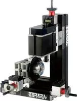

## DTZ10002MZ Фрезерный станок с расточной головкой с поворотной осью и делительным устройством (УДГ)

Big Power LCD Metal Gear Milling Machine DTZ10002MZ

Feature: 
1. Motor case and headstock are jointed. Maximum motor power is 144W by using more powerful motor. It can machine gears. 
2.Main parts: headstock, long machine bed, short machine bed, big slider, small slider, motor blade, connection piece, dividing positioner, gear etc. All of the parts above are made of metal. 
3. By using dividing plate, we can drill the round workpiece equally.
4. There are three circles of holes on the dividing plate and each circle with the same ratio holes. The number of the holes on each circle is respectively 36,40,48. We can choose them as needed. 
5. There are clear LCD on the hand wheel(Reading screen on the hand wheel instead of external display) to avoid the difficulties of scale reading, large parallax, easy to forget, greatly facilitate the user to read date while processing, increase the accuracy of the piece.
Technical parameters:                                                        
1.Motor speed :12,000rpm/min,2.Input voltage/current/power:12VDC/5A/60W,3. Working material: wood, engineering plastic, soft metal( gold, silver, copper, aluminum etc.) ,4.Maximum working material diameter clamped by three-jaw chuck:50mm ,5. The transformer has over-current protection , over-voltage protection, over-heating protection . 6. With 0.02mm scale line ,the handwheel increases the precision when processing. 7.Motor power :144W 8.Module :0.5, accuracy:0.03-0.05mm, formula : diameter=module0.5*number of teeth+1.9.Axis Y /Z travel :32mm, Axis X travel:145mm 10. Working material: lignin plastic, soft metal(gold, silver, copper, aluminum) etc.
11. Electronic Digital Liquid Crystal Display instead of scale readings, to avoid the difficulties of scale reading, large parallax and easy to forget. Clear hand-wheel LCD readout (LCD in the hand wheel position instead of external LCD) greatly facilitate the user to read the data while processing.
-The ZERO key could be in any position for starting point. -One button alter Metric and Inch. -With the memory function. Power will be cut off when stop using in one minute, when it is on, the screen will display the value of last operation.-Display accuracy up to 0.01mm.-The LCD screen using a 1.5V battery.
