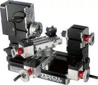

## DTZ20002MR Токарный станок с подачами и увеличенным расстоянием от станины с дополнительной малой продольной кареткой и поворотным модулем

Big Power LCD Crystal Digital rotating lathe DTZ20002MR

Features:
The machine tool adopts motor with more powerful horsepower. The Motor box and the main shaft box are in joint structure, and the digital liquid crystal display is used to replace the scale reading, it avoids the disadvantages of difficulty in reading scale, large parallax and easy to forget numerical value. Clear hand wheel type liquid crystal reading display (the liquid crystal reading is in the hand wheel position, not the external LCD reading) is greatly convenient for users to read processing data while processing, the ZERO position and machining starting point position can be set at any slider position through the ZERO key. It has the one-key conversion function of Metric/British, which is convenient for users to have different habits. It has the memory function. When it stops using for one minute, it will automatically cut off the power, and when the user presses the key again, it will automatically display the processing value when the power is cut off. The display accuracy can reach 0.01mm, the LCD display is powered by a 1.5V battery, and the Z1 axis small slider can rotate 180 degrees.
1. The main parts of the machine tool: such as the main shaft case, the tail seat, the long machine seat, the size of the slider, the motor fan blade, the gear, the connecting block, the four-claw card, etc. all adopt metal materials, belt protective cover
2. The center height is 75mm, and the center distance is 135mm. Generally, when turning metal, the rotating speed of the lathe drops to 2000 revolutions per minute.
3. The turning tool is made of high-speed steel, which can process soft, colored and precious metal, and it can be elevated by using middle block, and the diameter range can be expanded to 50mm.
Technical indicators:
1. Motor speed: 12000 revolutions per minute.
2. Input voltage/current/power/: 12VDC/5A/60W
3. The packaging adopts recyclable pulp mould, in this way, the products can be better protected during the transportation process and the environment will not be polluted in response to the environmental protection requirements of the country.
