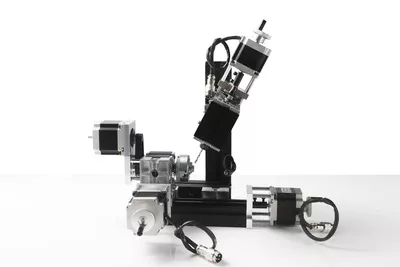
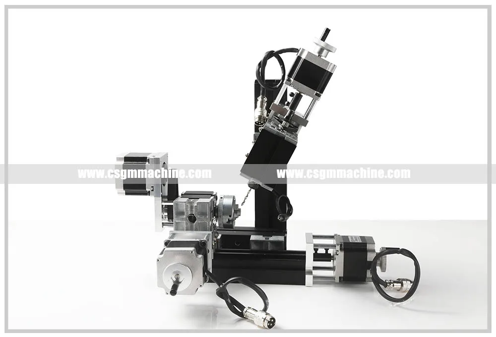
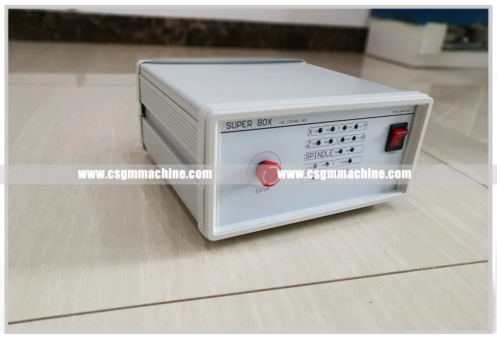
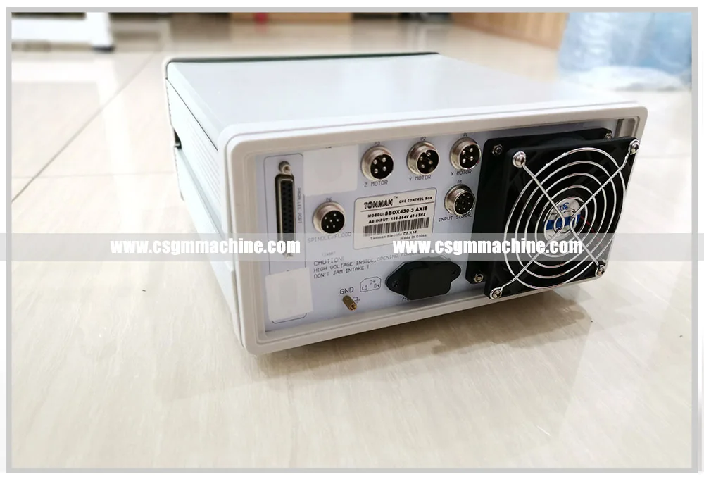

Технические параметры:
- Скорость двигателя: 12000 об./мин.
- Входное напряжение/ток/мощность: 12VDC/5A/60 Вт
- Ось Y, Z ползунок Путешествия 50 мм, ось X 145 мм
- Ось A = 360 °/200/8 = 0,225 °
- X.Y. Z. Шаговый двигатель: 1,5 Нм, ток 2 А, 1,8 °
- Точность: 0,07 мм
- 4 осей работают в то же время, может обрабатывать 3D поверхность
- Максимальный диаметр патрона: 50 мм
- Рабочий материал: Лигнин пластик, мягкий металл (золото, серебро, медь, алюминий и т. д.)
- Компьютерный порт: параллельный интерфейс
- Мощность контроллера и адаптера: Входной AC110-240V, выход DC12V, 5A

Four-axis CNC dividing drilling and milling machine TCZ10002MZ1

Features: The machine tool adopts motor with stronger horsepower, and the power of the main shaft motor can reach 144 W. The Motor box and the main shaft box are in joint structure, and the Z axis of the machine tool can rotate 360 degrees. 
1. Numerical control system: mach3 (or Zhouyu industrial system ). Technical indicators: 1. Slider stroke: X = 145mm Y = 50mm Z = 50mm A = 360 °/200/8 = 0.225 ° 
2. X, Y, Z, A Axis stepping motor: 1.5Nm, current 2A, 1.8 °, four-axis linkage, 3D surface processing 
3. Main shaft motor power adapter input voltage AC110V-240V, output voltage DC12V current 5A. 
4. Connect the computer port: parallel port 
5. Control box Power supply: control box Power supply: input AC110V-240V.

