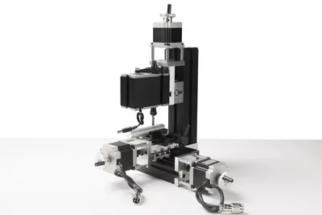

## TCZ20005M 3х осевой сверлильно-ферезерный станок

Three-axis metal CNC drilling and milling machine TCZ20005M

Features: 
The machine tool adopts motor with more powerful horsepower, and the power of the main shaft motor can reach 144 W. The Motor box and the main shaft box are of joint structure.
1. Numerical control system: mach3 (or Zhouyu industrial system) 2. Main parts of machine tool: such as spindle case, middle block, motor fan blade, gear, small slider (cross sliding), long slider, connecting block, long engine base, short engine base, Tiger pliers and so on all adopt metal materials.
3. Processing materials: wood plastic, soft metal (gold, silver, copper, aluminum, etc ).
Technical indicators:
1. Motor speed: 12000 revolutions per minute
2. Input voltage/current/power/: 12VDC/5A/60 W.
3. Main shaft motor power adapter input voltage AC110V-240V, output voltage DC12V current 5A.
4. Power supply of control box: input AC110V-240V 5. Connect computer port: parallel port
