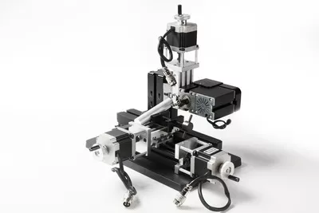

## TCZ20005MM горизонтальный фрезерный станок

Технические параметры:

- Система: Mach 3 (дополнительная промышленная система Zhouyu)
- Скорость двигателя: 12000 об./мин.
- Входное напряжение/ток/мощность: 12VDC/5A/60 Вт
- Ось Y, Z ползунок Путешествия 50 мм, ось X 145 мм
- Цанги: 1-6 мм
- Максимальный диаметр заготовки, зажатый машинными тисками: 50 мм
- X. Y. Zstepping Мотор: 1.5Nm, ток 2A, 1.8deg
- Точность: 0,07 мм
- Рабочий материал: Лигнин пластик, мягкий металл (золото, серебро, медь, алюминий и т. д.)
- Компьютерный порт: параллельный интерфейс
- Мощность контроллера и адаптера: Входной AC110-240V, выход DC12V, 5A
