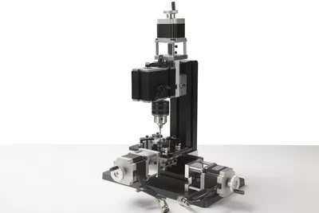

## TCZ4000M 3х осевой сверлильный станок

Three-axis CNC drilling machine TCZ4000M

Features: The machine tool adopts motor with more powerful horsepower, and the power of the main shaft motor can reach 144 W. The Motor box and the main shaft box are of joint structure. 
1. Numerical control system: mach3 (or Zhouyu industrial system) technical indicators: 
1. Motor speed: 12000 revolutions per minute
2. Input voltage/current/power /: 12VDC/5A/70W 
3, X, Y, Z stepping motor: 1.5Nm, current 2A, 1.8 °
 4, machining precision: 0.07mm 
5, main shaft motor power adapter input voltage AC110V-240V, output voltage DC12V current 5A. 
6. Connect the computer port: parallel port 
7. Control box Power supply: input AC110V-240V
