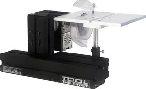

## TZ20001MCZ Торцевая пила

 Технические показатели:
 
- Скорость двигателя: 12000 об/мин (опционально 500 об/мин).
- Входное напряжение/ток/мощность/: 12 В постоянного тока/5 А/60 Вт.
- Площадь верстака: 150х190 мм.
- Он оснащен автоматическим устройством сбора пыли и устройством сбора стружки.
- Регулируемый угол пильного полотна: 0 ~ 45 градусов.
- Диаметр пильного полотна: 63 мм (80 мм опционально).
- Максимальная толщина резки составляет 25 мм.
- Применимая обработка: дерево, мягкий металл (медь, алюминий и т. д.), интегрированная плата, оргстекло, пластик и т. д. 

Rotary disc saw machine TZ20001MCZ

Features:
1. The machine tool adopts motor with more powerful horsepower, and the motor power can reach 144 W. The Motor box and the spindle box are of joint structure,
2. There is a transparent saw blade protective cover (the transparent protective cover is the one-time molding of the mould, not the organic glass ). Main parts of the machine tool: metal materials are used for main shaft case, long engine base, short engine base, connecting block, sawing table, rotating dividing plate, gear and so on.
Technical indicators:
1. Motor speed: 12000 r/min minutes.
2. Input voltage/current/power/: 12VDC/5A/60 W.
3. Workbench area: 150mm x 190mm. Self-contained automatic dust collection device, and dust collection device. Adjustable angle of Saw Blade: 0 ~ 45 degrees. Diameter of Saw Blade: 63mm, maximum cutting thickness: 25mm. Applicable processing: Wood, soft metal (copper, aluminum, etc.), integrated circuit board, organic glass, plastic, etc.
Note: the cutter used by circular saw is circular saw web, and the whole disk of circular saw web is Blade, which is dangerous to some extent. Therefore, it must be used under the guidance of professionals or teachers, and students cannot use it alone.
