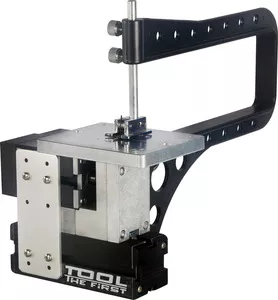
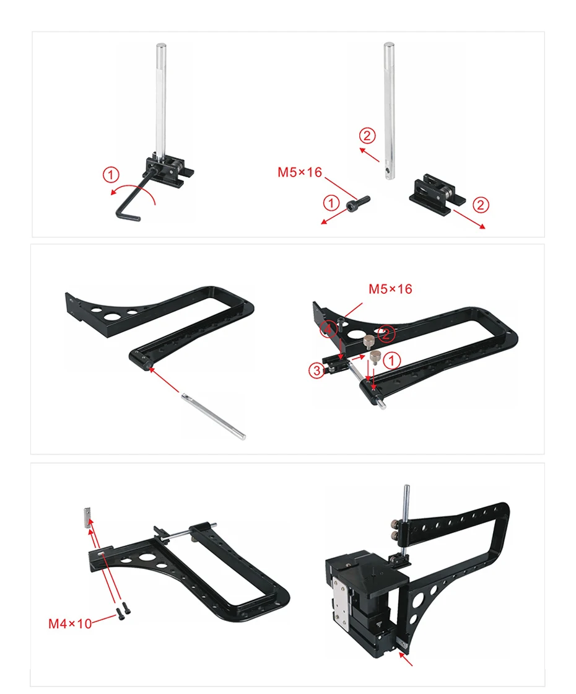
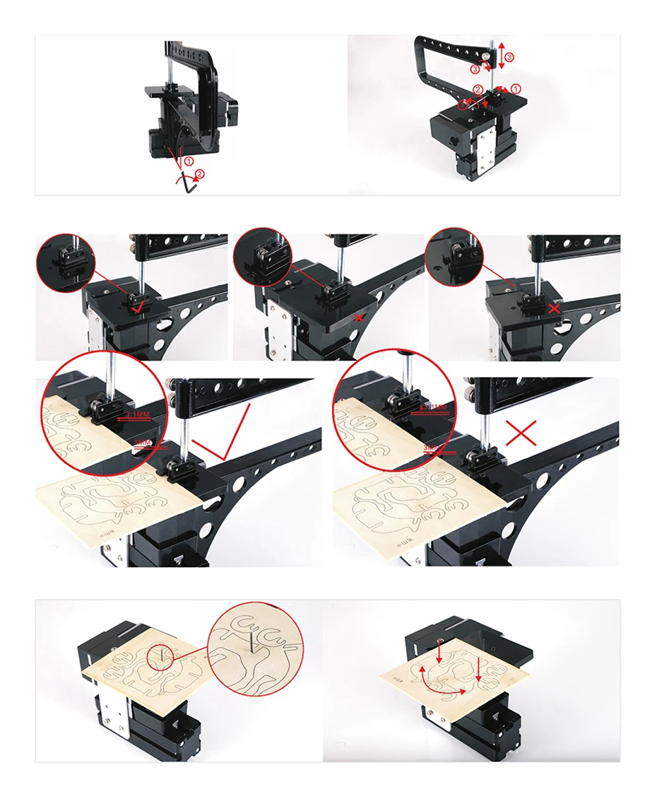

## TZ20001MG Лобзик с дуговым креплением пилки

Технические параметры:
- Скорость вращения двигателя	12000 об./мин. (дополнительный выбор 20000 об./мин.)
- Входное напряжение/ток/мощность	12 В DC/5A/60 Вт
- Размер рабочего стола устройства:	90 мм * 90 мм
- Максимальная толщина материала	Однотонный wood-4mm, plywood-7mm, мягкий wood-18mm, aluminium-0.5mm, acrylic-2mm.
- Мощность двигателя	60 Вт

Big Power Mini Metal Bow-Arm Jigsaw TZ20001MG

 Features：
  1. Motor case and headstock are jointed. Maximum motor power is 144W by using more powerful motor. Some parts are ectroplated to make the machine more beautiful and practical.
  2. Main parts include headstock, central block, jigsaw base, jig-saw casing, motor blade, gear, jigsaw table, connection piece , drive belt cover etc. All of the parts are made of metal except drive belt cover. 
  3.With special design, the reciprocating blade is touch safe in case of finger contact -it just causes slight vibration without cuts when skin contacts. 
  4. Allow straight-line cutting and curve cutting.
  4.Maximum working material thickness: solid wood-4mm, plywood-7mm, soft wood-18mm,  aluminium-0.5mm, acrylic-2mm. 
   Technical parameters:        
  1.Motor speed :12,000rpm/min
  2.Input  voltage/current/power:12VDC/5A/60W
  3.Working table size:90mm*90mm 
 5.The transformer has over-current protection, over-voltage protection, over  heating protection. 
6. With bow-shaped arm. The material of bow-shaped arm with
its accessories is metal which increases its durability.
7.Motor power :144W.

