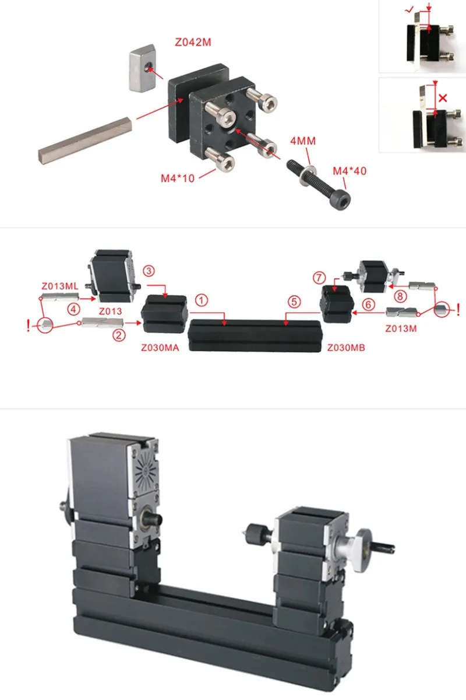
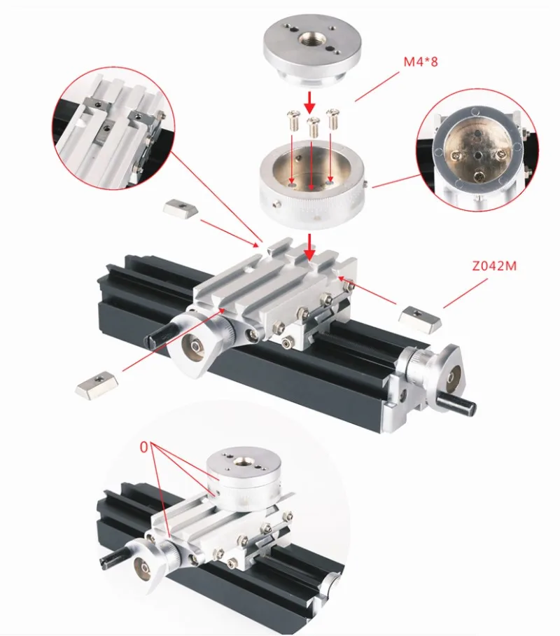
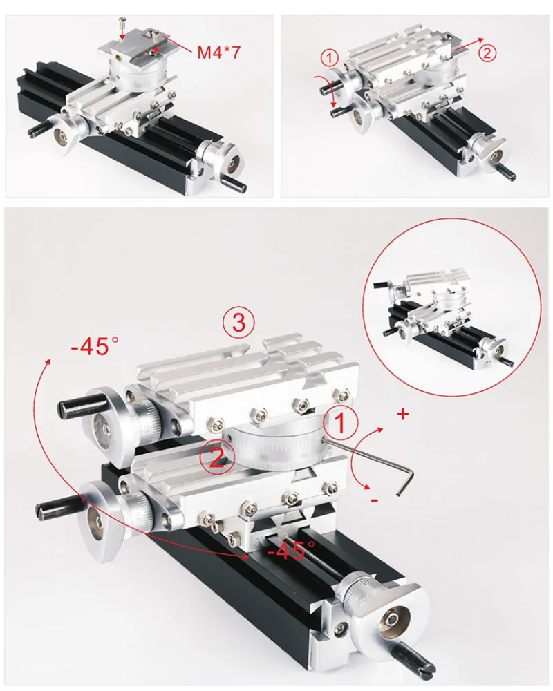
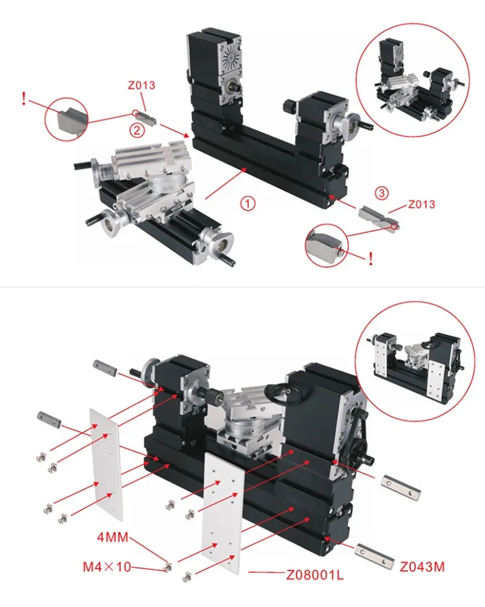
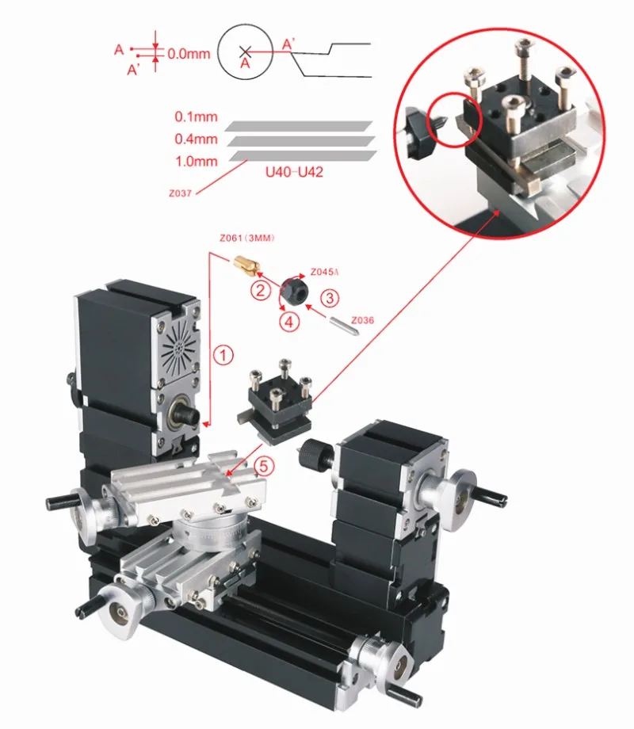
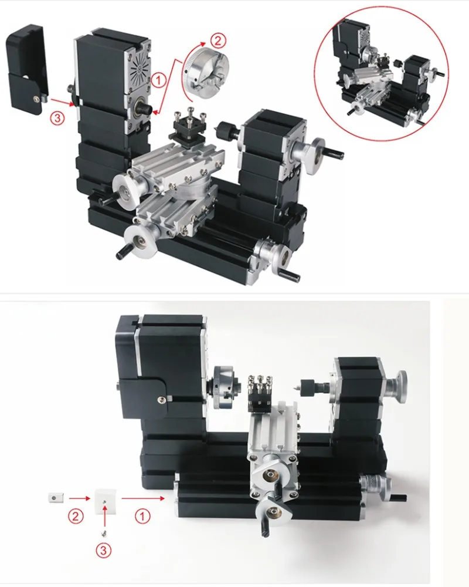
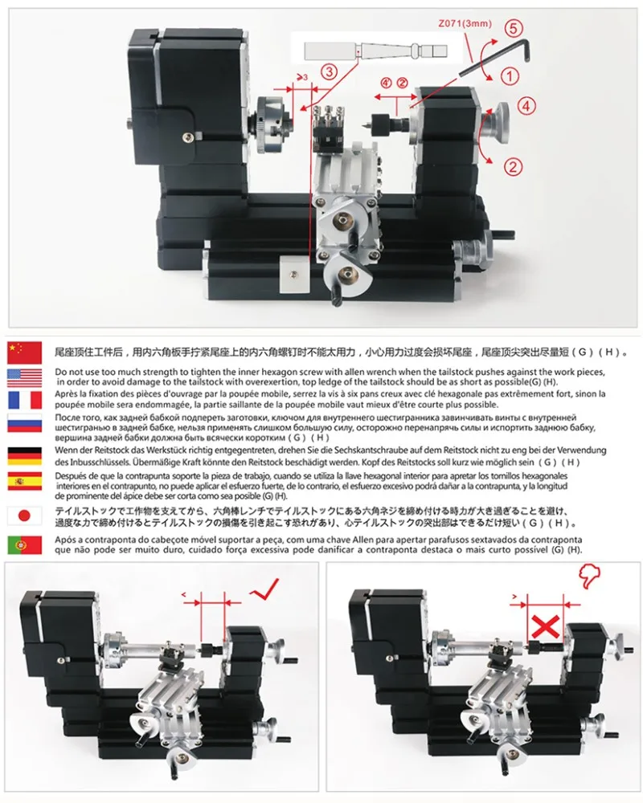

## TZ20002M Токарный станок с подачами

Технические параметры:

- Скорость двигателя: 12000 об./мин.
- Входное напряжение/ток/мощность: 12VDC/5A/60 вт
- Максимальный диаметр материала: 100 мм
- Длина материала: 135 мм
- Рабочий материал: лигнин пластик, мягкий металл (золото, серебро, медь, алюминий и т. д.), акрил, пластик и т. д.
- С 0,02 мм шкалой линии, маховик увеличивает точность при обработке.
- Мощность двигателя: 60 вт
- Ползунок оси Z: 145 мм, ползунок оси X: 32 мм
- Точность процесса: 0,05 мм

Big Power Mini Metal Lathe TZ20002M

Features: 
  1. Motor case  and headstock are jointed. Maximum motor power is 144W by using more powerful motor. Some parts are electroplated to make the machine more beautiful and  practical.
  2. Main parts: headstock,  tailstock, long machine bed, big slider, small slider, motor blade, gear, connection piece, drive belt cover etc. All of the parts are made of metal except drive belt cover.
  3.Center height-25mm, distance between centers-135mm, motor speed normally will drop to 2000rpm/min when it machines metal. 
  4. Lathe tool  is made of high speed steel quality material and it can process on soft metal, nonferrous metal and precious metal. By using central block, diameter can be expanded to 100mm.
  Technical  parameters:   
 1.Motor speed:12,000rpm/min
  2.Input voltage/current/power:12VDC/5A/60W 
  3.Maximum working material diameter:20mm 
  4.Working material length:135mm 
  5. Axis Z slider travel :32mm  Axis X slider travel:145mm 
6. Working material: lignin plastic, soft metal (gold, silver, copper, aluminum etc.), acrylic, plastic etc. 
7. With 0.02mm scale line ,the hand wheel increases the precision when processing.
8.Motor power :144W

