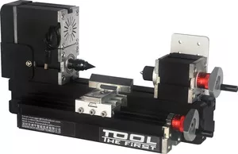

## Big Power Mini Metal Wood-turning Lathe TZ20003M

Big Power Mini Metal Wood-turning Lathe TZ20003M

 Features:
  1. Motor case and headstock are jointed. Maximum motor power is 144W by using more powerful motor. Some parts are electroplated to make the machine more beautiful and practical.
  2. Main parts: headstock, tailstock, long machine bed, big slider, wood-turning chisel base, motor blade, gear, connection piece, drive belt cover etc. All of the parts are made of metal except drive belt cover.  
 3. Softwood,  hardwood can be processed.  4.Workpieces can be clamped by three-jaw chuck or collets(1-6mm),center height-25mm, distance between center- 135mm. 
 Technical parameters:  
  1.Motor speed  :12,000rpm/min
  2.Input voltage/current/power:12VDC/5A/60W
  3.Maximum working material diameter: 45mm 
  4.Working material length:135mm  
 5.Working material: wood, engineering plastic, soft metal( gold,
  6. The transformer has over-current protection, over-voltage protection, over  heating protection.
  silver, copper, aluminum etc.). 
  7.With 0.02mm  scale line ,the hand wheel increases the precision when processing.
8.Motor power : 144W
