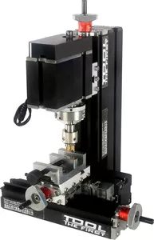

## TZ20005MF Станок для изготовления "бусин"

Big Power Metal Beads Machine TZ20005MF

 Features:
1. Motor case and headstock are jointed. Maximum motor power is 144W by using more powerful motor. It can process beads. Some parts are electroplated to make the machine more beautiful and practical. Some parts are electroplated to make the machine more beautiful and practical. 2. Main parts: headstock, long machine bed, short machine bed, big slider, small slider, motor blade, gear, connection piece, vice etc. All of the parts are made of metal.
Technical parameters:
1.Motor speed :12,000rpm/min
2.Input voltage/current/power:12VDC/5A/60W
3. Working material: wood, lignin plastic
4.Maximum working material size clamped by three-jaw chuck:50mm 5.The transformer has over-current protection , over-voltage protection, over-heating protection .
6.With 0.02mm scale line ,the handwheel increases the precision when processing.
7,Motor  power :144W。
8..Maximum working material diameter clamped by vice:50mm 9.Between slider space ,there is plastic elastic material to adjust the precision. 10、 Axis Y travel:：30mm， Axis X /Z travel ：145mm； 11. Working material: wood, plastic, acrylic, soft metal(gold, silver, copper,  aluminum etc.) 12、Maximum beads diameter:20mm
13. The flank and front of the beads blade are dangerous , so people need to be guided by the professional when using it.
