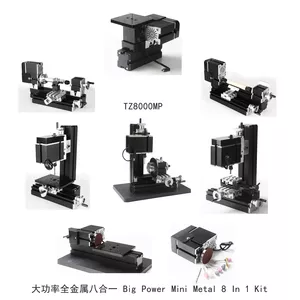

## TZ8000M 8 металлических станков большой мощности 60Вт

Big Power Mini Metal 8 In 1 Kit TZ8000M

This machine kit can be assembled into 1)Jigsaw 2)Wood-turning lathe 3)Metal lathe 4)Milling machine 5)Drilling machine 6)Sanding machine 7)Hand-held machine 8)Drilling machine with dividing plate Only one kind of machine can be assembled at the same time.
1. Motor case and headstock are jointed. Maximum motor power is 144W by using more powerful motor.
2.Main parts: headstock, central block, jigsaw base, jigsaw casing, motor blade, gear, woodturning chisel base, cross slider, big slider, drilling lever, drilling table, jigsaw table, connection piece, tailstock, sanding paper panel, dividing positioner, vice(all of the parts above are made of metal), drive belt cover, grinding wheel, wheel guard.
Technical parameters:
1.Motor speed :12,000rpm/min
2.Input voltage/current/power:12VDC/5A/60W,
Switching power input: 110V—240V 
