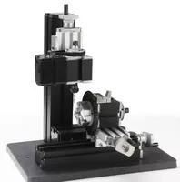

## Z10002M Сверлильный станок с поворотной осью и делительным устройством (УДГ)

Metal Drilling Machine With Dividing Plate Z10002M

 Feature:
1.Main parts: headstock, radial arm, long machine bed, short machine bed, small slider, big slider, motor blade, connection piece, dividing positioned, gear etc. All of the parts are made of metal.
2. By using dividing plate, we can drill the round workpiece equally.
3. There are three circles of the holes on the dividing plate and the number of the holes respectively is 36,40,48. We can choose them as needed.
Technical parameters:   
1.Motor speed :20,000rpm/min(optional choice 12,000rpm/min)
2. Input voltage/current/power:12VDC/2A/24W
3. Working material: wood, engineering plastic, soft metal (gold, silver, copper, aluminum etc.)
4. Maximum workpiece diameter clamped by three-jaw chuck:50mm
5. The transformer has over-current protection , over-voltage protection, over-heating protection .
6. With 0.02mm scale line, the hand wheel increases the precision when processing
