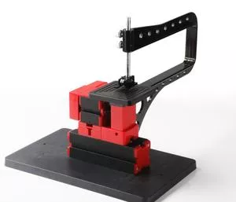

## Z20001G Лобзик с дуговым креплением пилки

Mini Bow-Arm Jigsaw Z20001G

Feature:
  1.With special design, the reciprocating blade is touch safe in  case of finger contact -it just causes slight vibration without cuts when   skin contacts. Motor blade and gear are made of metal. 
  2. Allow straight-line cutting and curve cutting.
  3. Machine color is made up of red and black.
  Technical parameters:
  4. Maximum working material thickness: solid wood-4mm,
  1.Motor speed :20,000rpm/min
  2.Input voltage/current/power:12VDC/2A/24W 
  3.Working table size:90mm*90mm        
  protection, over heating protection.
  plywood-7mm, soft wood-18mm, aluminium-0.5mm, acrylic-2mm.
  5.The transformer has over-current protection, over-voltage
  6. Withbow-shaped arm. The material of bow-shaped arm with its accessories is metal which increases its durability. Certificate transformer passed: CE,UL
