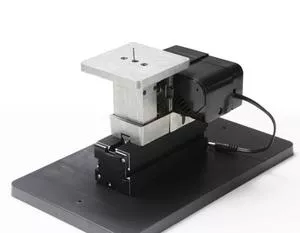

## Z20001M Маятниковый лобзик

Mini Metal Jigsaw Z20001M

Features：
  1.Motor case and headstock are jointed. 
  2. Main parts include headstock, central block, jigsaw base, jig-saw casing, motor blade, gear, jigsaw table, connection piece, drive belt cover etc. All of the parts are made of metal except drive belt cover.
  3.With special design, the reciprocating blade is touch safe in case of finger contact -it just causes slight vibration without cuts when skin contacts。
  4.Allow straight-line cutting and curve cutting.
  4. Maximum working material thickness: solid wood-4mm, plywood-7mm, soft wood-18mm, aluminium-0.5mm, acrylic-2mm.
  Technical parameters:    
  1.Motor speed : 20,000rpm/min(optional choice 12,000rpm/min)
  2.Input voltage/current/power:12VDC/2A/24W
  3.Working table size:90mm*90mm    
 5. The transformer has over-current protection, over-voltage protection,over heating protection
