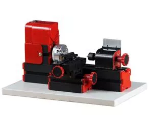

## Z20002 Токарный станок с подачами

Metal Lathe Z20002

Feature:
  1.Working material: wood, and engineering plastic ，soft metal etc.  Machine color is made up of red and black. Motor blade and gear are made of metal.
  Technical parameters:    
  3.Maximum working   material diameter:20mm
  1.  Motor speed :20,000rpm/min
  2.Input voltage/current/power:12VDC/2A/24W
  5. The transformer has over-current protection, over-voltage protection, over heating protection.   Certificate Transformer passed: CE,UL
  4.Working material   length:135mm
