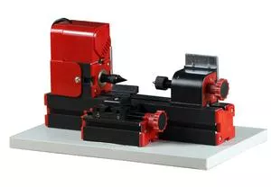

## Z20003 Токарный станок по дереву для обработки с помощью ручных резцов и упором

Wood-turning Lathe Z20003

Feature:
  1.Softwood,  hardwood can be processed.
  2. Workpieces can be clamped by three-jaw chuck or collets(1-6mm),center height-25mm, distance between center- 135mm.
  Technical  parameters:
  1.Motor speed :20,000rpm/min, motor and gear are made of metal 
  4.Working  material length:135mm   
  2.Input voltage/current/power:12VDC/2A/24W 
  3.Maximum  working material diameter: 45mm
  6. The transformer has over-current protection, over-voltage protection, over heating protection.
  5.Working material: wood, engineering plastic, soft metal(copper, aluminum  etc.)
