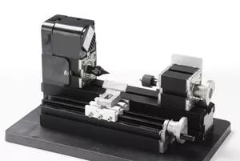

## Z20003M Токарный станок по дереву для обработки с помощью ручных резцов и упором

Mini Metal Wood-turning Machine Z20003M

Features:
  1. Main parts: headstock, tailstock, long machine bed, big slider, motor blade, gear, connection piece, drive belt cover etc. All of the parts are made of metal except drive belt cover.
  2. Softwood, hardwood can be processed.
  3. Workpieces can be clamped by three-jaw chuck or collets(1-6mm),center height-25mm, distance between center- 135mm.
  4. Working material length:135mm    
  Technical parameters:   
  1.Motor speed :20,000rpm/min(optional choice 12,000rpm/min)
  2. Input voltage/current/power:12VDC/2A/24W
  3. Maximum working material diameter: 45mm
  5. Working material: wood, engineering plastic, soft metal( gold, silver, copper, aluminum etc.).
  6. The transformer has over-current protection, over-voltage protection, over heating protection.
7.  With 0.02mm scale line ,the hand wheel increases the precision when processing
