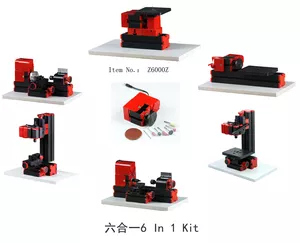

## Z6000 6 базовых пластиковых станков

6 In 1 basic mini machine kit Z6000

The six-in-one set can form 6 kinds of machine tools with different functions (wire sawing machine, wood lathe, metal lathe, milling machine, drilling machine and Sand Mill), and only one of the machine tools can be assembled and used at a time. 
1. Motor speed: 20000 revolutions per minute. 
2. Input voltage/current/power: DC12VDC/2A/24 W, the input voltage of switching power AC110V-240V. It is a good tool for family and school children to make aerial models and other woodworking models
