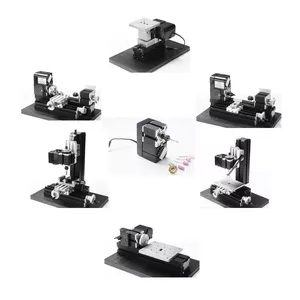

## Z6000M 6 металлических станков малой мощности 24Вт

Metal 6 In 1 mini machine kit Z6000M

This machine kit can be assembled into 1)Jigsaw 2)Wood-turning lathe 3)Metal lathe 4)Milling machine 5)Drilling machine 6)Sanding machine 7)Hand-held machine Only one kind of machine can be assembled at the same time.
Main parts: headstock, central block, jigsaw base, jigsaw casing, motor blade, gear, wood-turning chisel base, cross slider, big slider, drilling lever, drilling table, jigsaw table , connection piece, sanding paper panel , vice , drive belt cover, grinding wheel, wheel guard etc. All parts are made of metal except drive belt cover, grinding wheel and wheel guard.
Technical parameter:
1.Motor speed: 20,000rpm/min
2.Input voltage/current/power: 12VDC/2A/24W,  switching power input: 110V-240V
All machines are safe to touch except milling machines. It is requested to use under adult's instructions.
It is a good tool for families and schools to make model airplane and other wooden models and crafts.
