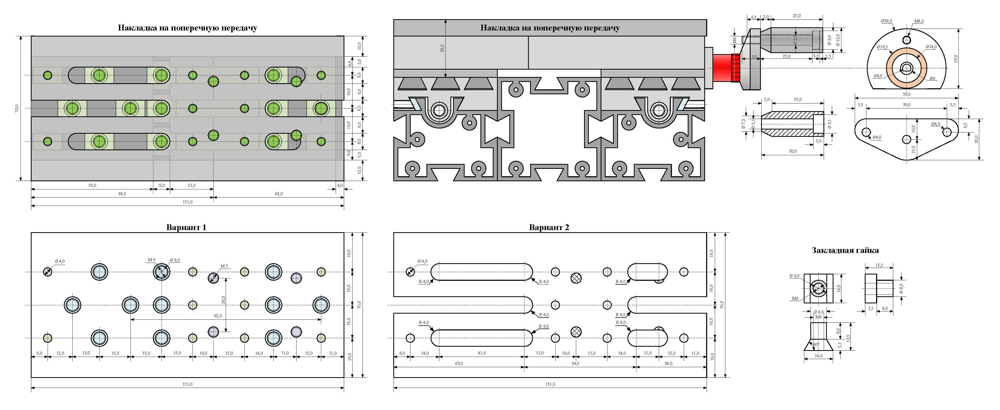
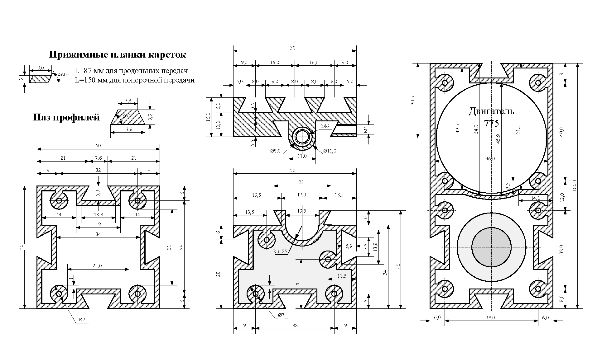
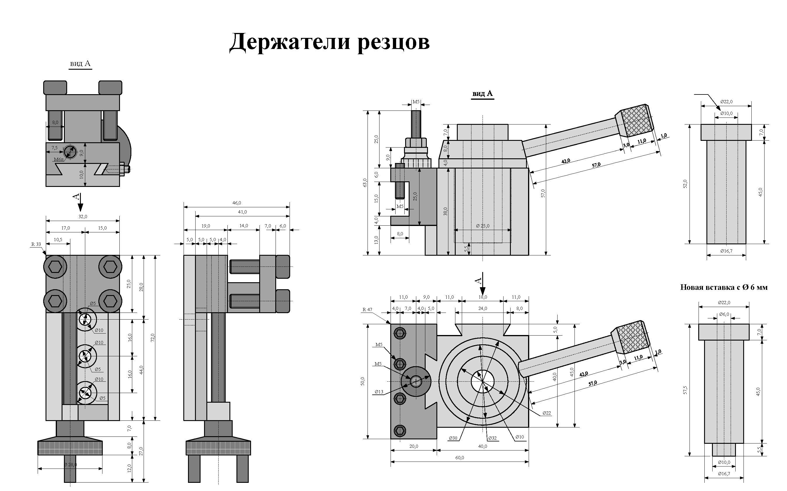
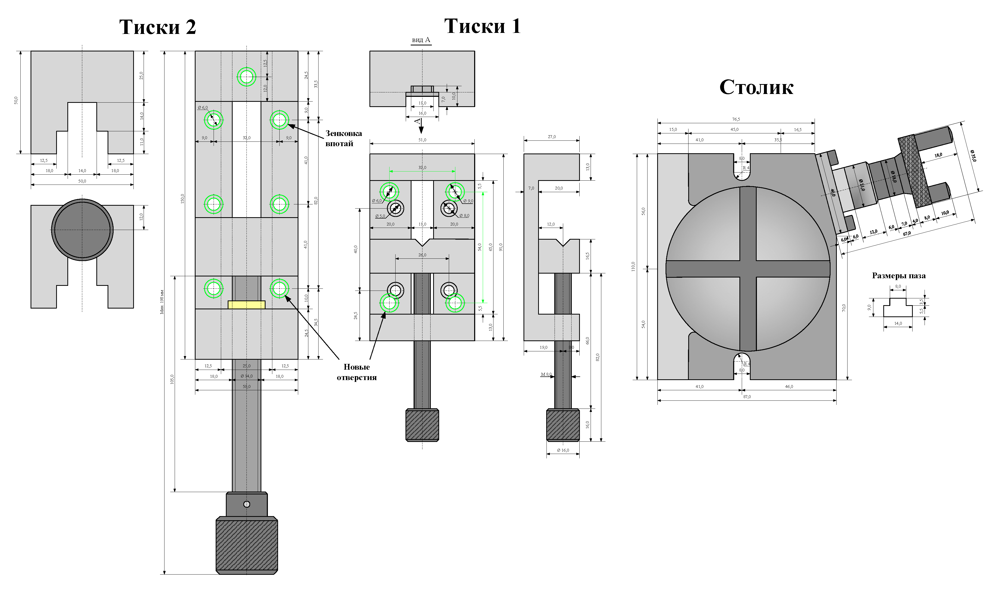
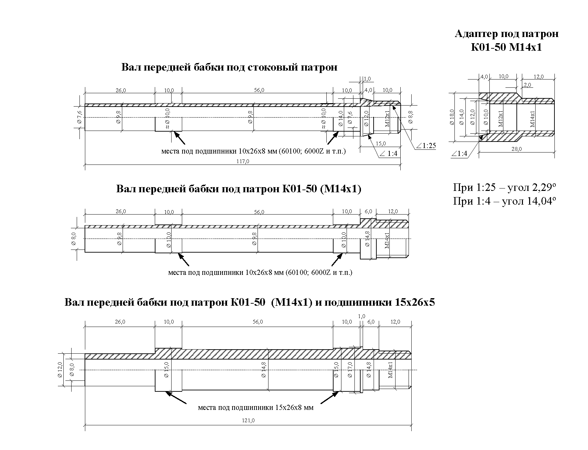

### Чертежи взяты с [форума судомоделистов, где их сделал пользователь Stasys](https://www.shipmodeling.ru/phpbb/viewtopic.php?t=72530&start=180)
Скопировано что бы избежать утраты чертежей

Пример соединения двух продольных кареток, чертежи ручки

Основные профили станка, разрезы кареток, корпус моторного блока

Альтернативные резцедержатели которые можно купить

Варианты альтернативных тисков и разметка под сверловку отверстий

Валы шпинделя

