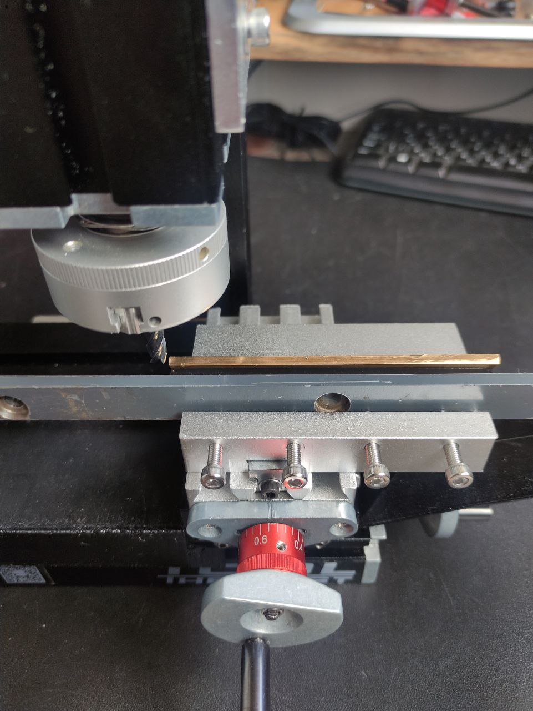
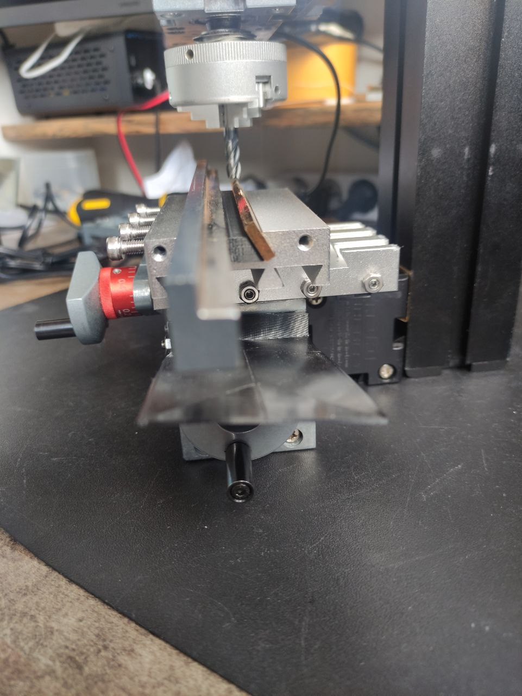
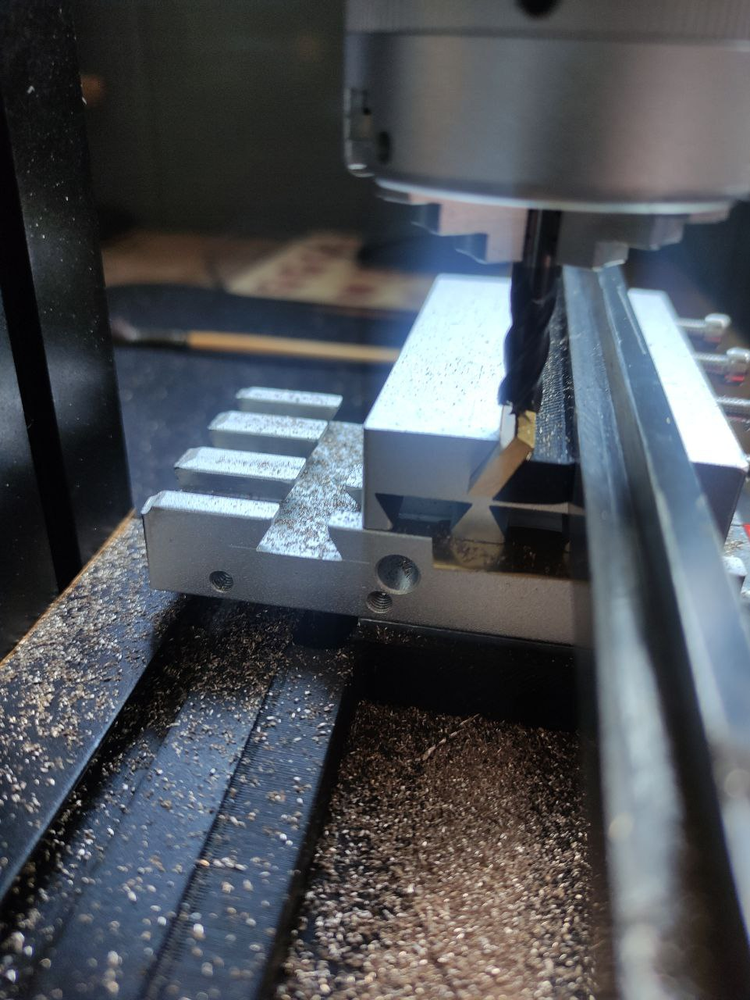
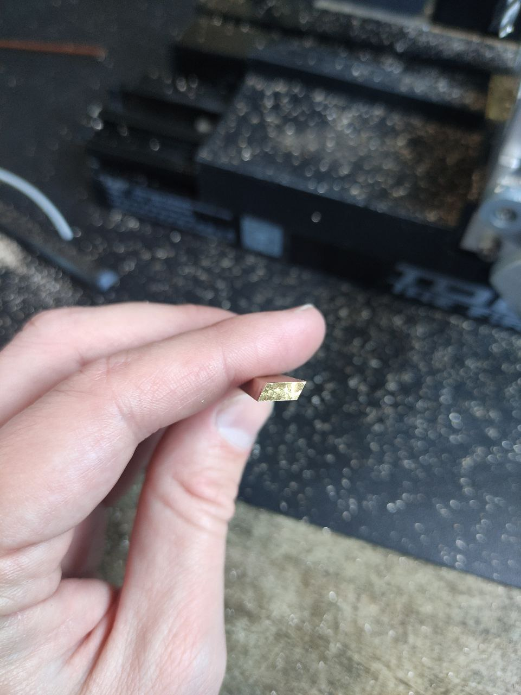
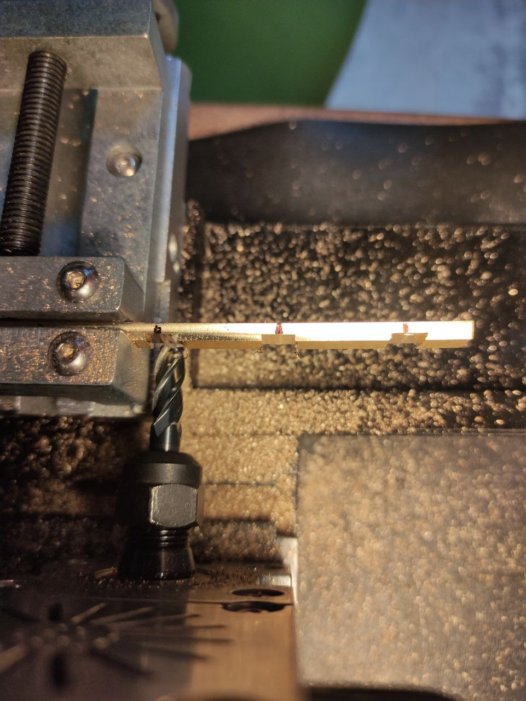
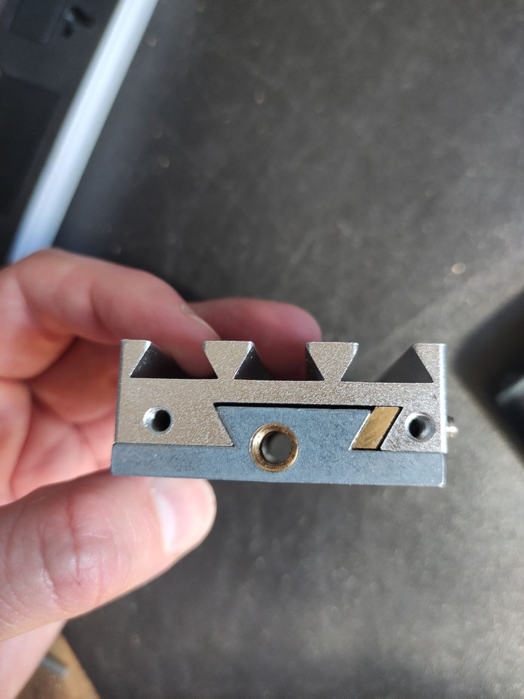
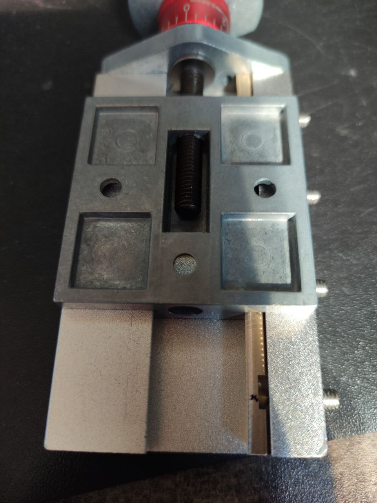

# Латунный клин для каретки

В результате замеров выяснилось что малая каретка движется волнами, внимательно рассмотрев ластохвост каретки увидел что он был сделан на литьевой форме состоящей из нескольких частей, в месте их соединения неизбежно возникли неровности, то есть одна часть чуть выше другой. Так же в середине ласточкиного хвоста есть выборка под шляпку винта крепления. Штатный пластиковый клин прижимается несколькими винтами с острыми носиками прогибается в местах контакта, обрзуются волны на поверхности клина. При передвижении эта волны в местах прижима проваливаются в неровности на ласточкином хвосте, вот и получается что каретка как бы плавает по волнам, сильно страдает точность при перемещении поперечной и вертикальной подачи.
Что бы устранить этот эффект решил сделать латунный клин.

Для этого надо отфрезеровать под углом 60 градусов, и тут варианта 3:
* Использовать фрезу ласточкин хвост 60градусов,
* Использовать поворотное устройство и развернуть шпиндель фрезера
* Зажать деталь под углом.

Мне доступен только 3тий метод. Решил что отлично этому послужит сама каретка перевернутая вверх ногами, ведь там уже есть нужный нам угол 60 градусов, останется только сделать прижим любым доступным способом, с любой точностью по сути. Можно вообще использовать кусок шпильки\длинного винта или кругляк порядка 5мм. Но так как есть 3D-принтер был изготовлен пластиковый клин который поджимает заготовку к ластохвосту каретки и просто стальная полоса чтоб поджатие было равномерным. Поджатие производил через резьбы регулировочных болтов. 

Перевернул заготовку и отфрезеровал другой ее торец. 

И последнее - пазы для регулировочных винтов. Я вставил клин в каретку, затянул винты поджима, они сделали отпечатки на клине своими острыми носиками. Орентруясь по этим отпечатанным точкам делаю фрезеровку. На самом деле как показала практика фрезеровка эта лишняя и клин вполне себе хорошо сидит на месте и не сдвигается за счет этих углублений которые набивают прижимающие винты. Максимум что можно сделать зенковкой или тонким сверлышком чуть чуть углубить эти отверстия (не более 0.5мм) что бы прижимающий винт заходил чуть поглубже в тело клина.
Ну и результат на фото.

