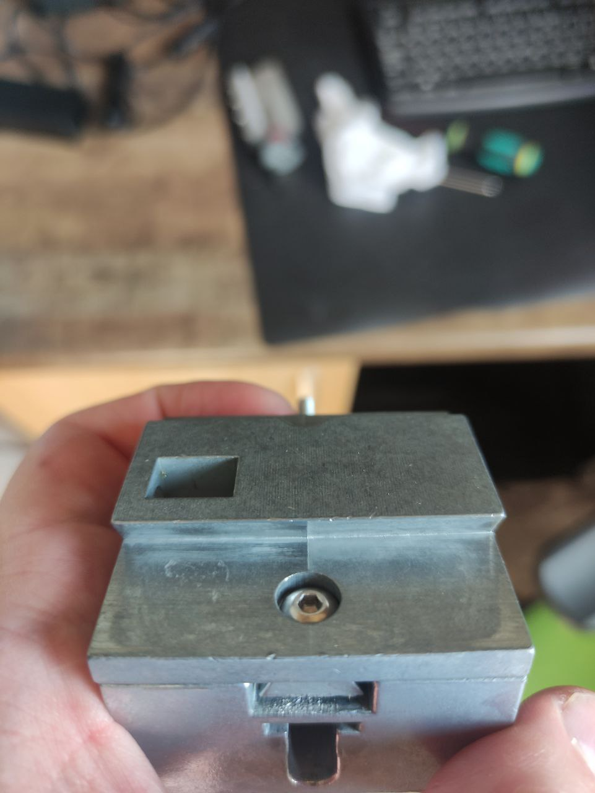
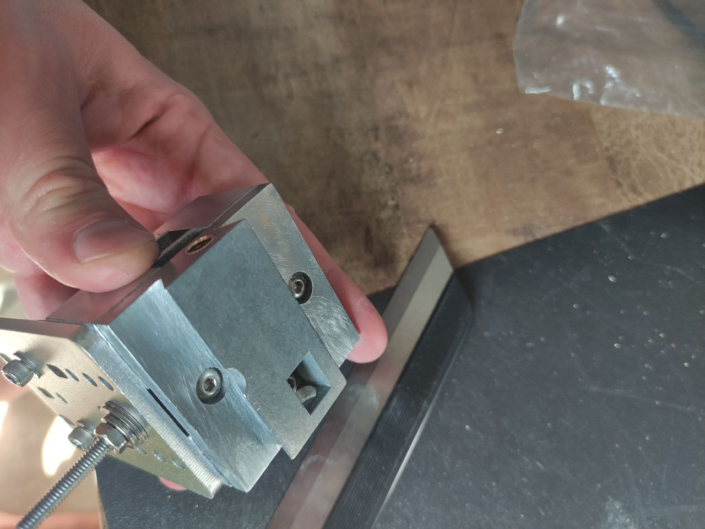

# Выравнивание поверхности ласточкиного хвоста малой каретки

Здесь видно как в середине ластохвоста имеется полоса от литьевой формы, проблема что когда место прижима клина винтом проезжает это место появляется смещение каретки.

Поработал немного надфилем, без энтузиазма, тут главное сбить горб и не навредить геометрии. По хорошему надо отфрезеровать это, но тут нужна фреза 60градусов и отлично выставленный станок, ни того ни другого у меня не было на момент доработки, поэтому фрезерованием сделаю только хуже. А вот надфилем, контролируя поверхность по лекальной линейке на просвет можно поправить этот узел (на фото). Ну и замер отклонения от перпендикуляра с латунным клином и поправленым ластохвостом. Результат 0.03 на 35мм подачи! И никаких виляний в 0.2мм что было раньше. А это я еще прижим клина после модернизации не настраивал. Но результат уже более чем устраивает. Такую доработку рекомендую однозначно, просто и эффективно.

