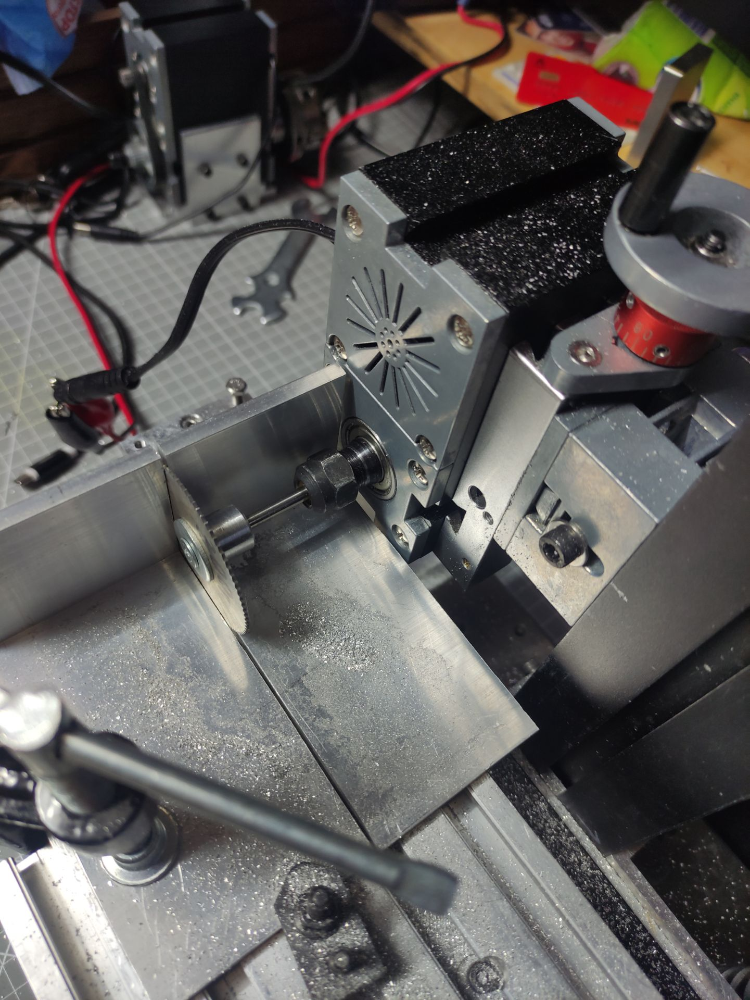
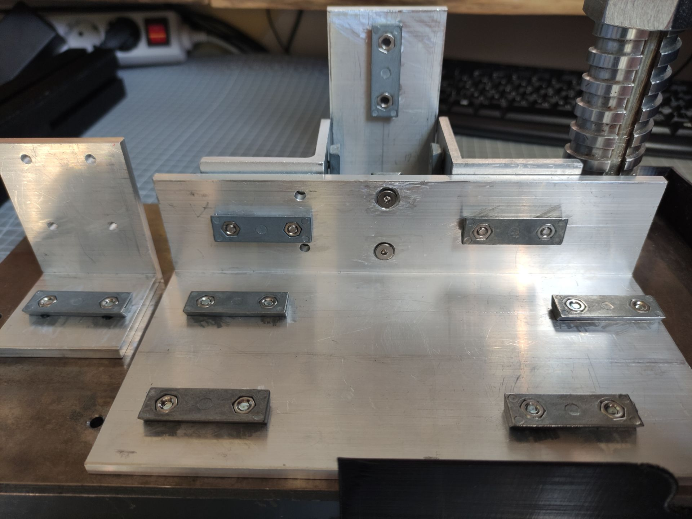
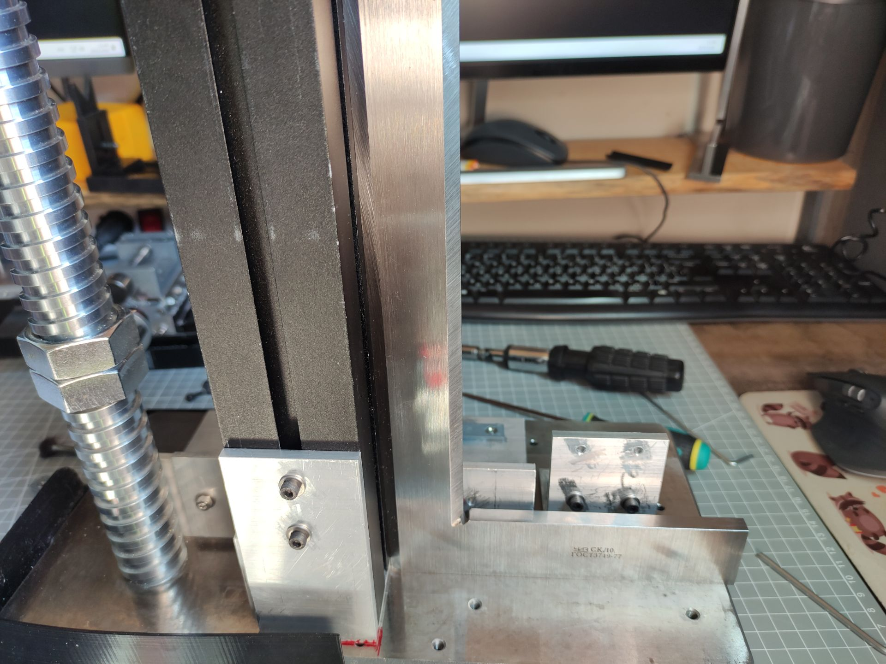
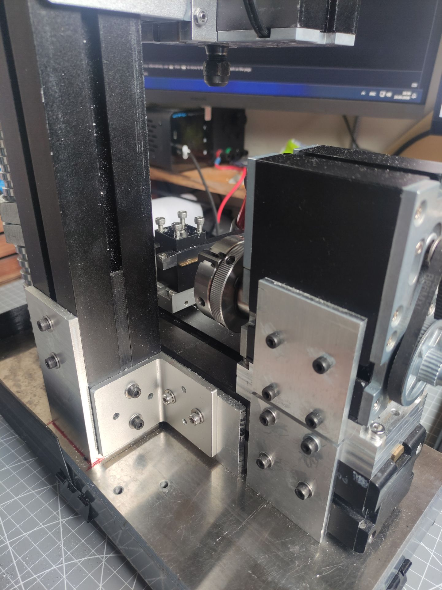

# Крепление фрезерной колонны (новая версия)

Ранее использовал стандатный способ крепления колонны фрезера к основной горизонтальной балке станка через отверстия просверленные насквозь балки. Мне пришлось смещать колонну немного правее и это вызвало сложности:
* Под новое место нужно фрезеровать новые отверстия в балке
* Достаточно хлипкие балки сильно ослабляются отверстиями
  
Поэтому решил пересмотреть всю систему крепления фрезерной колонны на станке, во первых отказаться от отверстий. Вместо что бы ослаблять места креплений буду усиливать их. Так же конструкция крепления не должна достаточно просто крепиться на станке через штатные ласточкины хвосты в балках, что позволит сдвигать колонну при надобности без переделок или например закрепить ее на длинной балке 51см.

Решил крепления делать на основе алюминиевого уголка 100х50х5, увы достаточно качества нержавеющий уголок или хотя бы стальной мне найти не удалось, у всех что мне попадались внутренний угол был далеко не 90 градусов, а вот алюминиевые уголки продаются отличного качества с ровными 90 градусами (проверил по лекальному угольнику). И так нерезал несколько отрезков уголка, один 20см (под размер продольной подачи), это основа для закрепления подачи, осовной балки станины, ну и с внешней стороны уголка будет крепиться колонна фрезера. Еще пару уголков шириной 50см, один под закрепление колонны сзади, второй под закрепление передней бабки. Остальной крепеж стандарный - двойные гайки в ластохвост и винты к ним, рекомендую под винты подкладывать шайбы что ты не проминать алюминий.

Размечал штангенрейсмасом просто на столе, удобно, гораздо удобнее чем штангенциркулем. Ну и сверление большого количества отверстий, как правило по месту. Обычно нужно насверлить одно отверстие, далее вставляем в него винт с двойной гайкой и отмечаем где будет второе отверстие. Размечать по приборам - бесполезно, у китайцев очень приблизительные размеры этих двойных гаек. Вид готового крепления до установки самого станка.

Сборку нужно вести в следующем порядке:
* Прикручиваем к основному уголку колонну как спереди так и сзади, затягиваем винты (спереди винты сделаны в потай)
* Легкими постукиванием влево-вправо устанавливаем по угольнику вертикальный угол
* Затягиваем угловые усиливающие крепления на самой фрезерной колонне
* Задвигаем горизонтальную балку внутрь угольника и затягиваем усиливающие крепления от колонны уже на горизонтальной балке
* Контролируем уольником вертикальное расположение колонны относительно верхней плоскости горизонтальной балки
* Собираем остальные части конструкции станка

Ну и финальный результат станка с креплением на фото.

