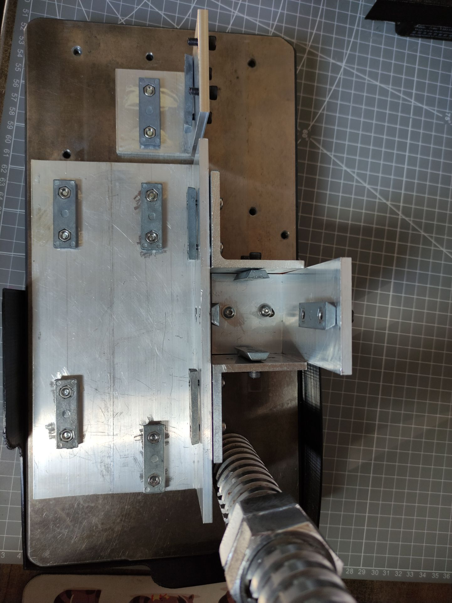

# Крепление фрезерной колонны (новая версия)

Ранее использовал стандартный способ крепления колонны фрезера к основной горизонтальной балке станка через отверстия, просверленные насквозь в балке. Мне пришлось смещать колонну немного правее, и это вызвало сложности:
* Под новое место нужно фрезеровать новые отверстия в балке
* Достаточно хлипкие балки сильно ослабляются отверстиями
  
Поэтому решил пересмотреть всю систему крепления фрезерной колонны на станке, во-первых, отказаться от отверстий. Вместо того чтобы ослаблять места креплений, буду усиливать их. Также конструкция должна крепиться на станке через штатные «ласточкины хвосты» в балках, что позволит сдвигать колонну при надобности без переделок или, например, закрепить её на длинной балке 51 см.

Решил делать крепление на основе алюминиевого уголка 100х50х5. Увы, достаточно качественный нержавеющий уголок или хотя бы стальной мне найти не удалось: у всех, что мне попадались, внутренний угол был далеко не 90 градусов, а вот алюминиевые уголки продаются отличного качества с ровными 90 градусами (проверил по лекальному угольнику). Итак, нарезал несколько отрезков уголка: один 20 см (под размер продольной подачи) — это основа для закрепления подачи и основной балки станины, ну и с внешней стороны уголка будет крепиться колонна фрезера. Ещё пару уголков шириной 50 см: один под закрепление колонны сзади, второй под закрепление передней бабки. Остальной крепеж стандартный — двойные гайки в «ластохвост» и винты к ним. Рекомендую под винты подкладывать шайбы, чтобы не проминать алюминий.

Размечал штангенрейсмасом прямо на столе, удобно, гораздо удобнее, чем штангенциркулем. Ну и сверление большого количества отверстий — как правило, по месту. Обычно нужно просверлить одно отверстие, далее вставляем в него винт с двойной гайкой и отмечаем, где будет второе отверстие. Размечать по приборам бесполезно: у китайцев очень приблизительные размеры этих двойных гаек. Из интересного можно заметить пару моментов. Первое: две гайки крепления колонны (передняя и задняя) расположены вертикально, они усиливают колонну от качания вперёд-назад. Второе: заднюю гайку крепления удалось поднять на 50 мм выше, что, в теории, должно усилить крепление колонны. Ну и вид готового крепления до установки самого станка.

Сборку нужно вести в следующем порядке:
* Прикручиваем к основному уголку колонну как спереди так и сзади, затягиваем винты (спереди винты сделаны в потай)
* Легким постукиванием влево-вправо устанавливаем по угольнику вертикальный угол
* Затягиваем угловые усиливающие крепления на самой фрезерной колонне
* Задвигаем горизонтальную балку внутрь угольника и затягиваем усиливающие крепления от колонны уже на горизонтальной балке
* Контролируем угольником вертикальное расположение колонны относительно верхней плоскости горизонтальной балки
* Собираем остальные части конструкции станка

Ну и финальный результат станка с креплением на фото.

