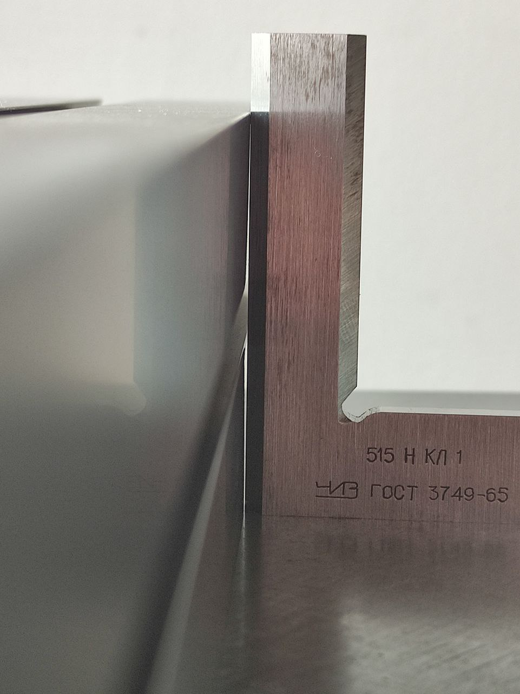
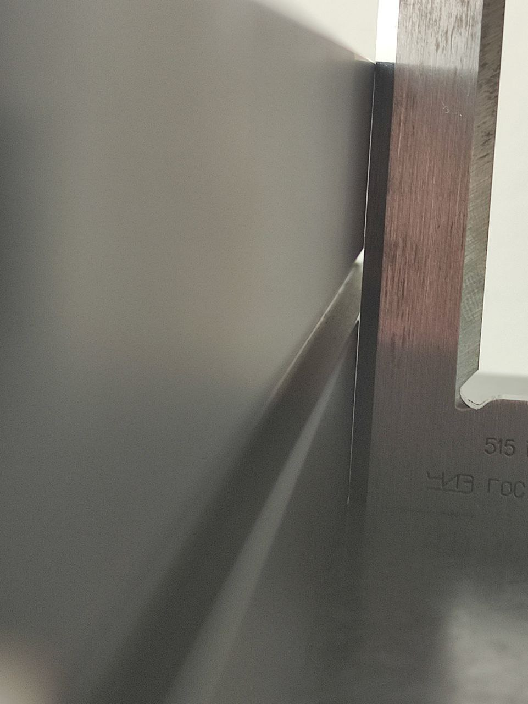
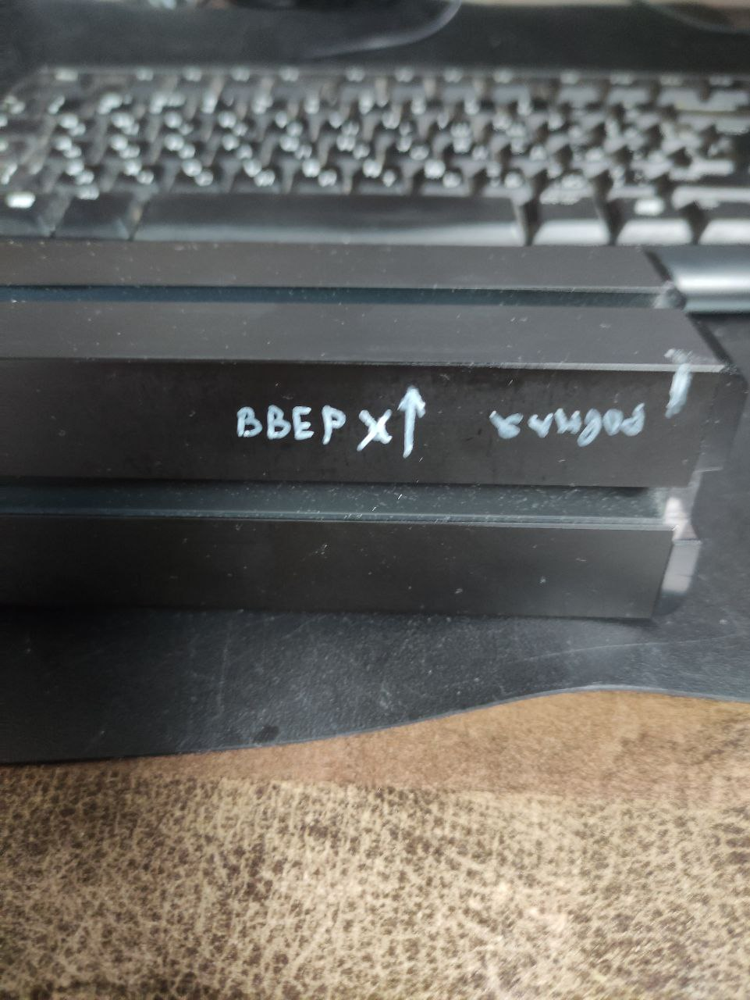
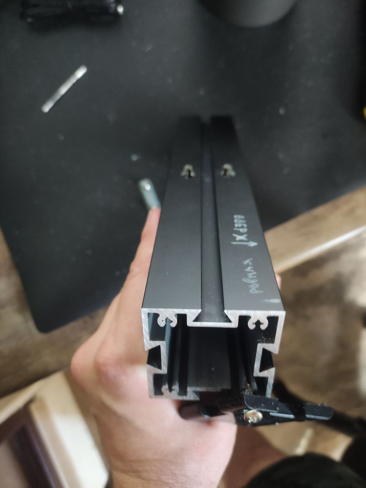
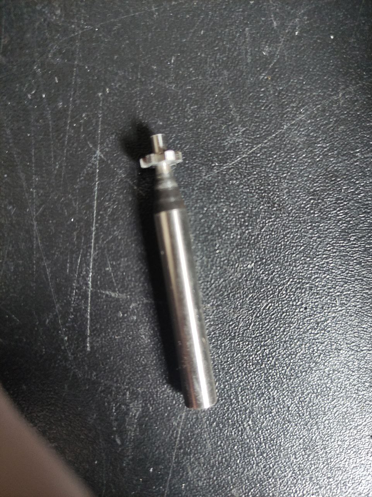
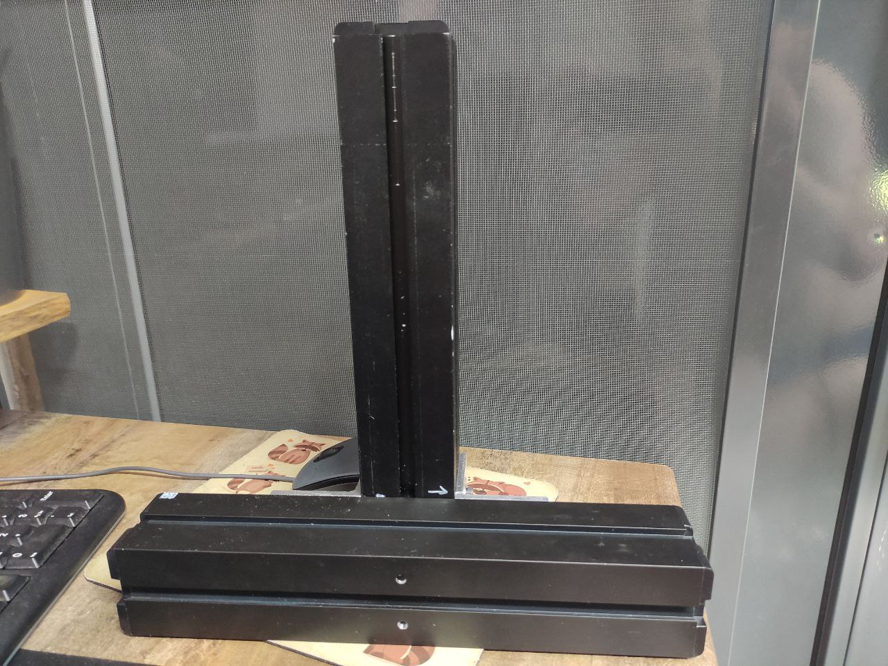
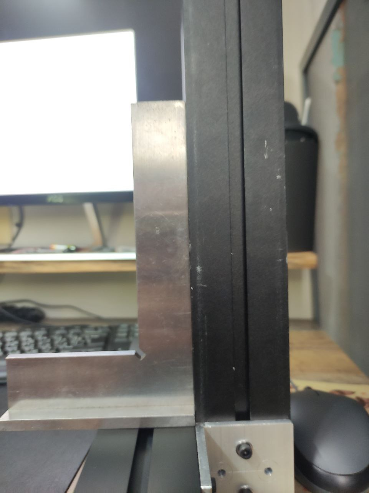

# Фрезер из двух балок 28см

Купил себе вторую длинную балку 28см для того что бы сделать удлиненную станину фрезера, дело в том что сборка/разборка и выставление перпендикуляра между колонной и основанием долгое занятие, чтобы не мучаться решил что основание должно быть длинное. Так же это увеличит вес станка, что то же отлично. Для начала решил определиться а где у балки ровные углы 90град и ровные плоскости (на фото 1, 2 видно какое отличие в просвете), оказался всего 1 такой угол. 

Использовал поверочную плиту и угольник. Пометил нужные мне плоскости и хороший угол. 

На ровной плоскости будем фрезеровать отверстие под крепления колонны. Увы они приходятся на область где проходит внутри крепления крышки, но ничего не поделать. С горем пополам отфрезеровал отверстия, а потом внутренюю область расширил т-образной фрезой под шляпки винтов.

На фото финальный результат, за счет того что измерял лучший угол и плоскости удалось добиться хорошего угла между колонной и станиной без подкладок. Добавил еще один уголок крепления

