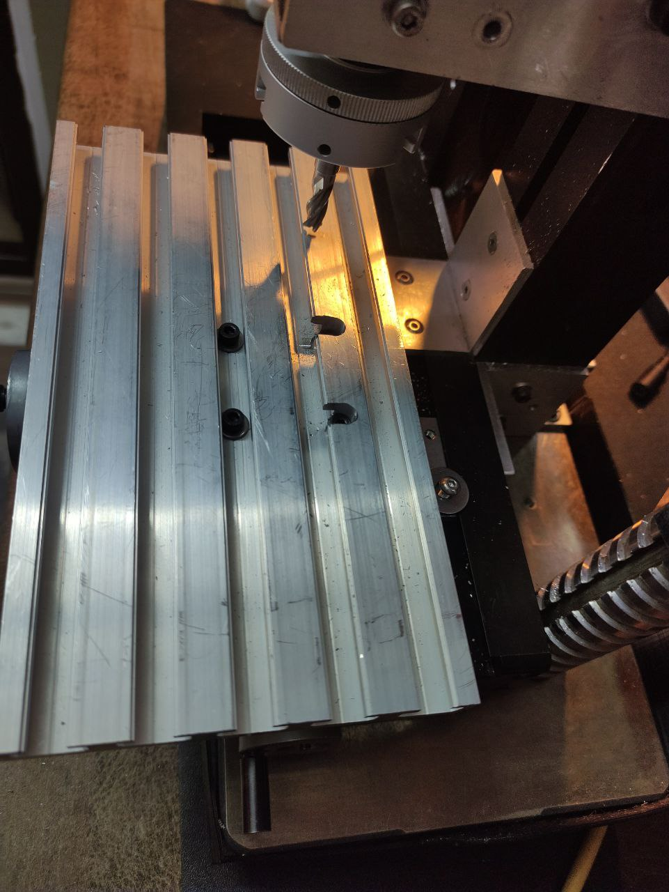
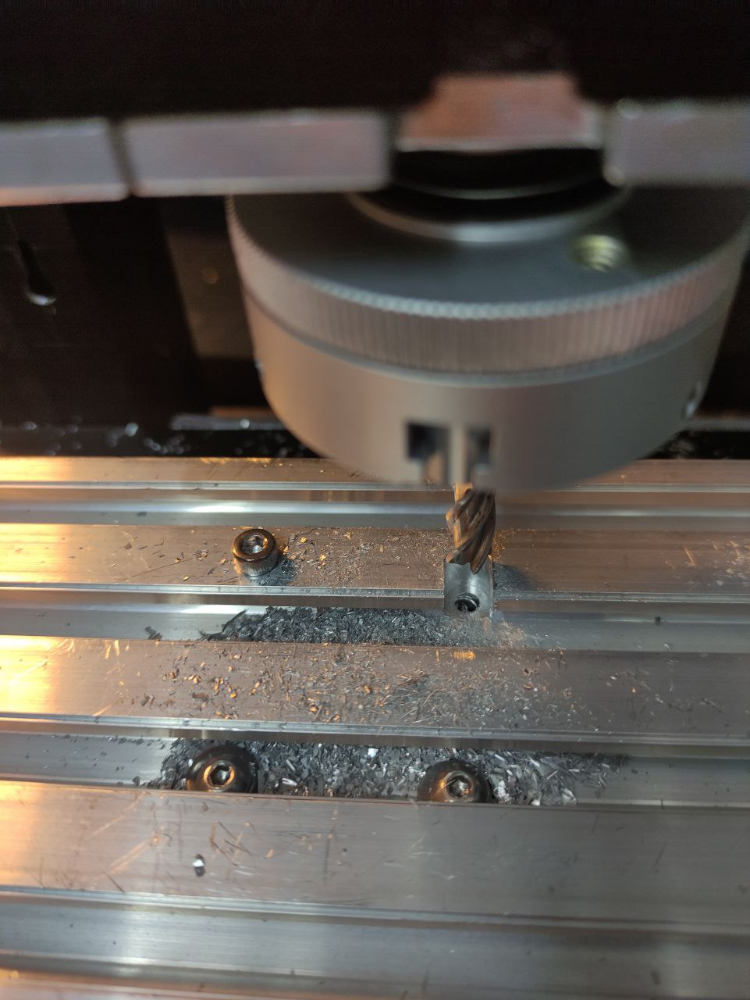
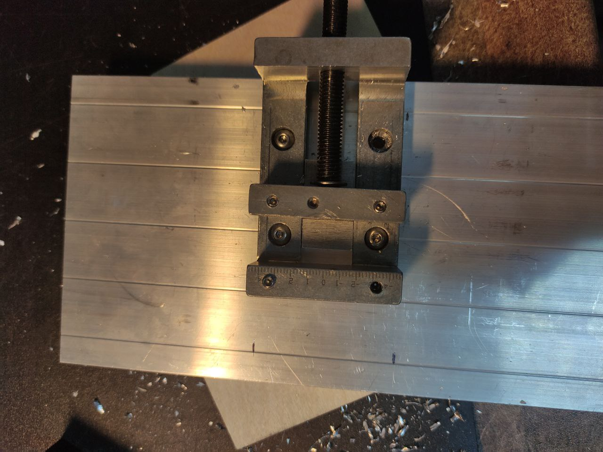
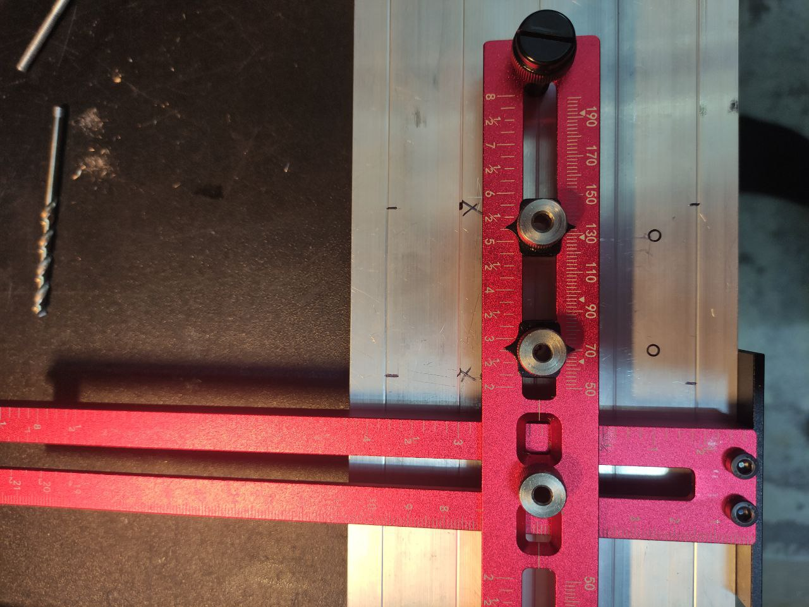
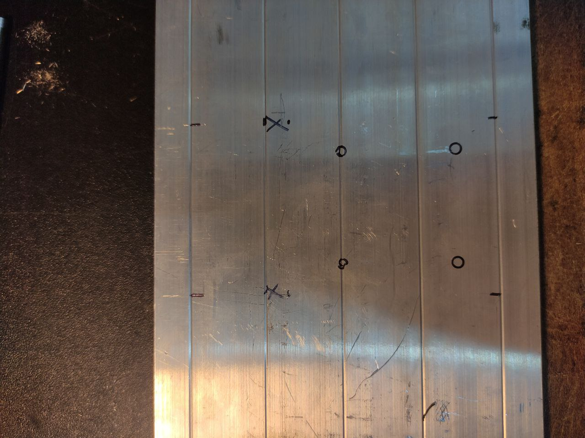
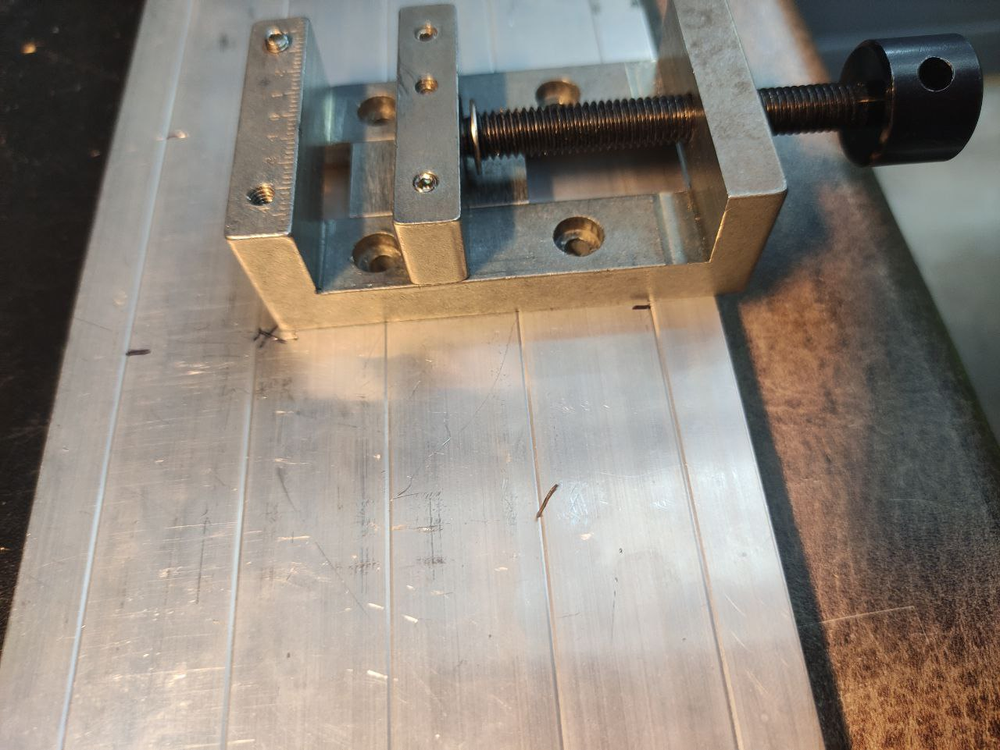
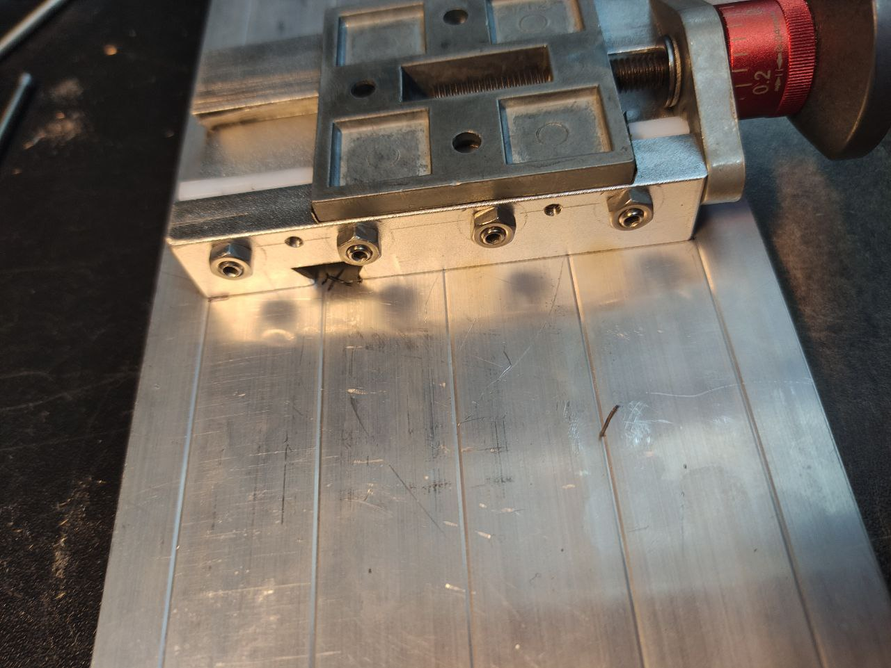

На станке не хватает большого фрезерного стола, а я недавно покупал заготовку профиль с т-пазами 200х110 и пора его приладить на станок.
Для начала разметил центр стола и с помощью малой каретки наметил как она должна стоять и где примерно сверлить отверстия. Далее с помощью тисков используя их как шаблон разметил отверстия.
Есть у меня такой кондуктор для сверления отверстий, использовал его что бы проверлить первые два отверстия. А дальше прикрутил тиски в эти два отверстия и сверлил уже через них используя их отверстия как кондуктор.
Дальше закрепил стол на поперечной каретке и отфрезеровал отверстия под шляпку болта фрезой 7мм которые совпали с ребром стола. Ну и готовый результат на фото.

