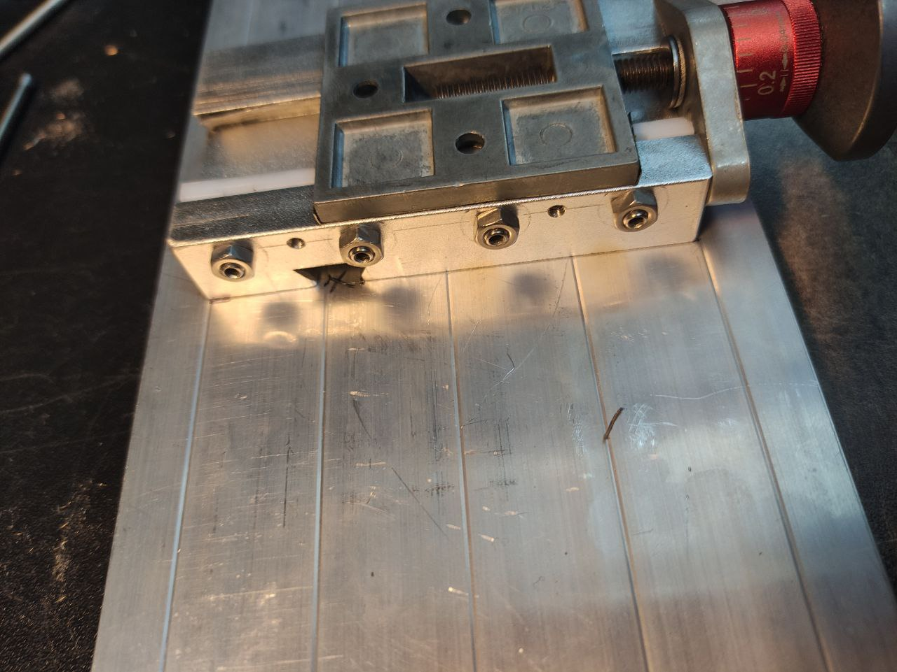
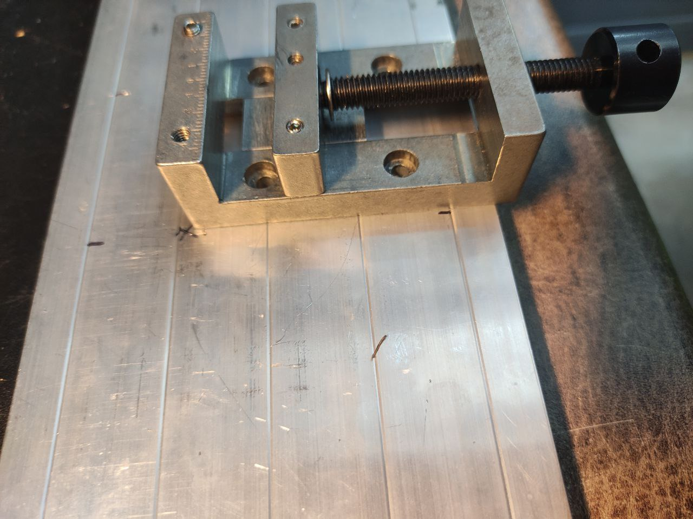
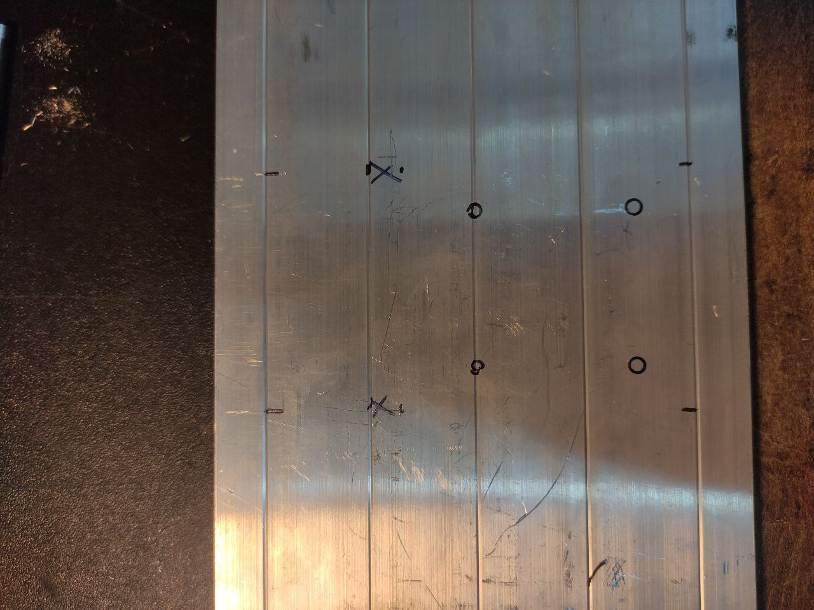
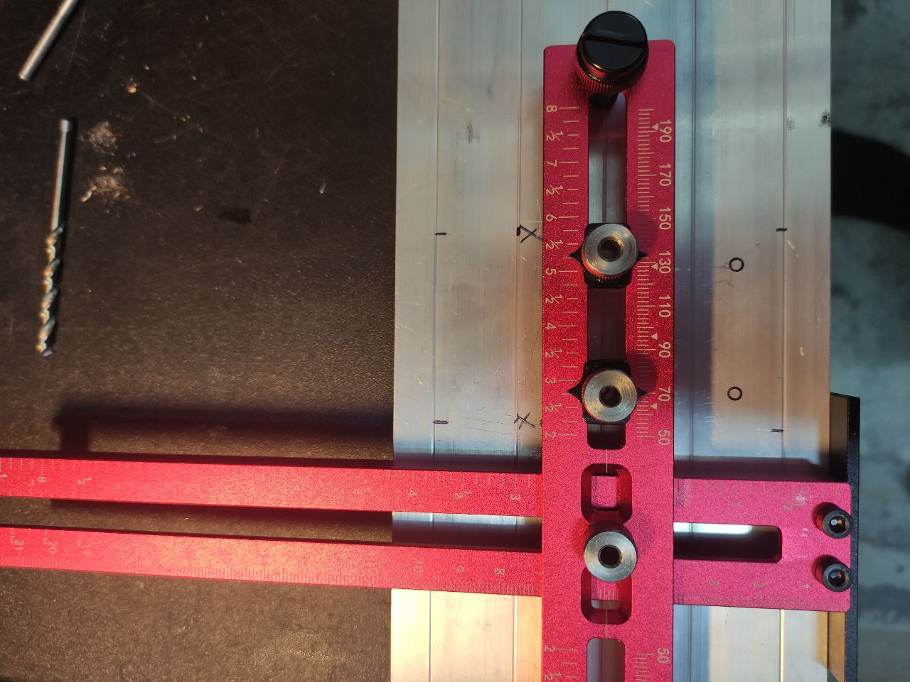
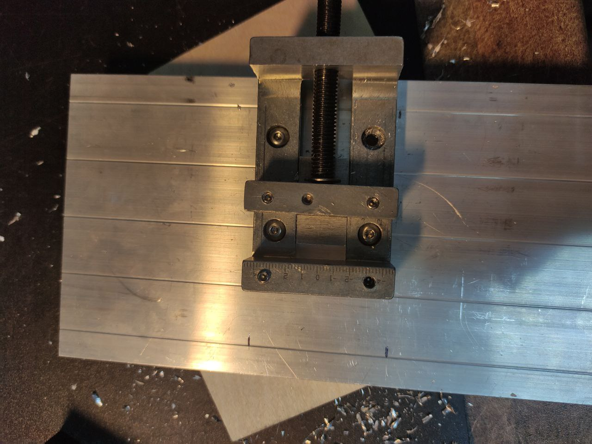
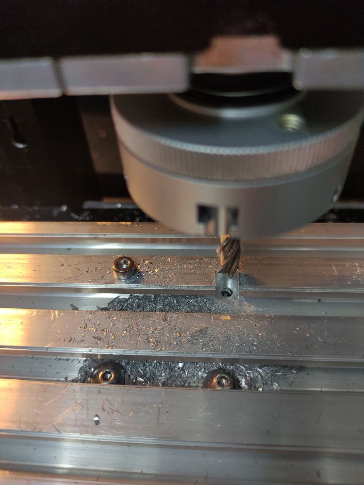
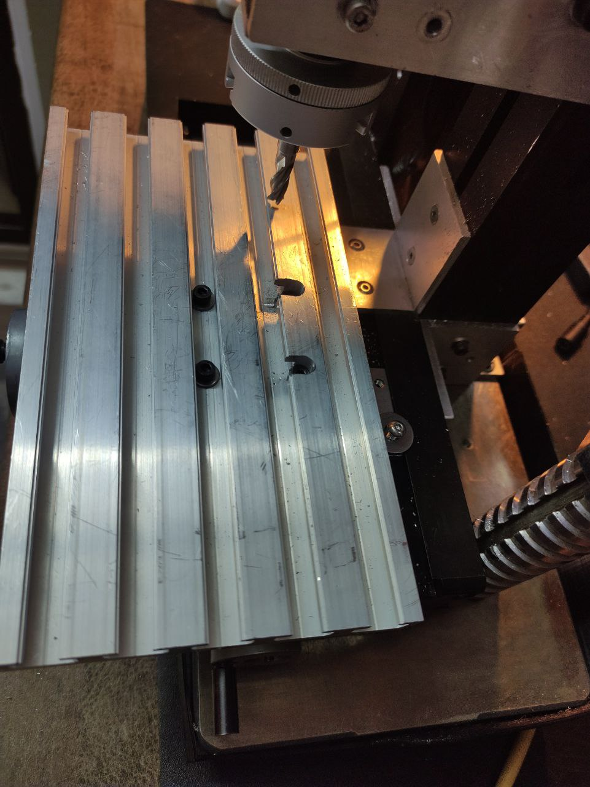

# Фрезерный стол

На станке не хватает большого фрезерного стола для работы с прижимами, в интернете продается заготовка профиль с т-пазами 200х110, я купил ее.
Для начала разметил центр стола и с помощью малой каретки наметил как она должна стоять и где примерно сверлить отверстия.

Далее с помощью тисков используя их как шаблон разметил отверстия.

Есть у меня такой кондуктор для сверления отверстий, использовал его что бы проверлить первые два отверстия (сразу скажу что идея неудачная - кондуктор для столярных работ поэтому люфты в нем бешенные и точности в нем никакой нет, не используйте если у вас есть такой же). Правильное решение было бы - использовать угольник в широким основанием типа УШ-160 для разметки, либо штангенрейсмас если он у вас есть. 

А дальше прикрутил тиски в эти два отверстия и сверлил уже через них используя их отверстия как кондуктор.

Дальше закрепил стол на поперечной каретке и отфрезеровал отверстия под шляпку болта фрезой 7мм которые совпали с ребром стола. Ну и готовый результат на фото.

UDP: за кадром были сделаны еще 2 отверстия ниже, это позволило закреплять стол на 6 точках крепления, 4х оказалось мало и не всегда удобно. Так же используйте винты в "потай" либо с плоской шляпкой (они порядка 1.2мм в толщине) иначе из за головок болтов не удается закрепить прижим в нужных местах. Хотя сама по себе идея с таким большим столом получилась очень даже здравая для тех кто фрезерует довольно крупные для станочка заготовки. Я например распиливаю на горизонтальном фрезере заготовки длиной до 20см и толщиной до 15мм, их разумеется невозможно закрепить на стандартном столе каретки поперечной подачи.

