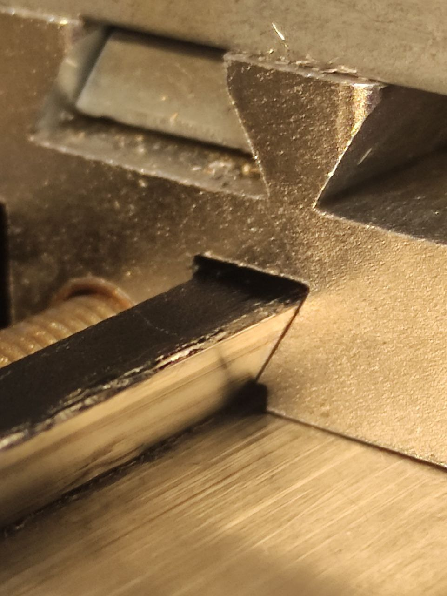

Решил переделать систему прижима клина для того что бы устранить перекос, а так же доработать саму каретку что бы было правильное прижатие плоскостей ластохвоста. В каретке просверлил отверстия 2.5мм между штатными винтами прижима и нарезал резьбу м3. Расстояние от низа каретки выбирал минимально возможное 2.5мм, но увы вспучило алюминий в этих местах и пришлось плоскость скольжения исправить шабером. Так же убрал острые углы как на клине так и на каретке с прижимающихся к ластохвосту поверхностей. По итогу стал равномерный прижим как клина так и каретки к поверхностям направляющих. Ход каретки стал более плавным, а усилие прижима клина удалось увеличить

