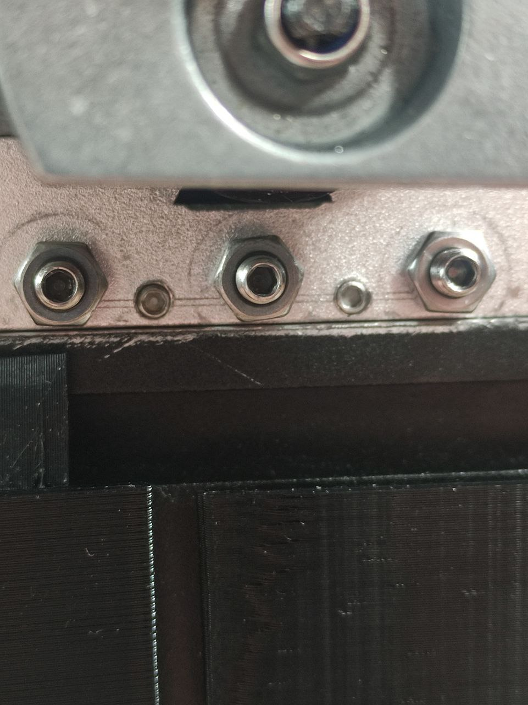
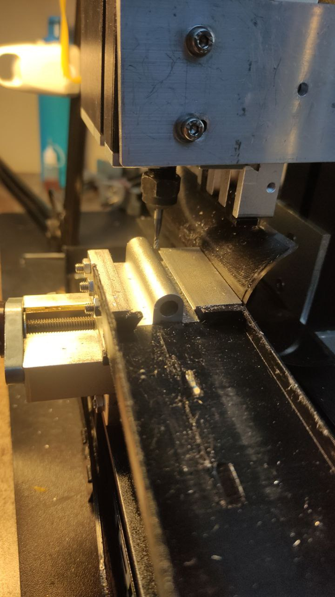
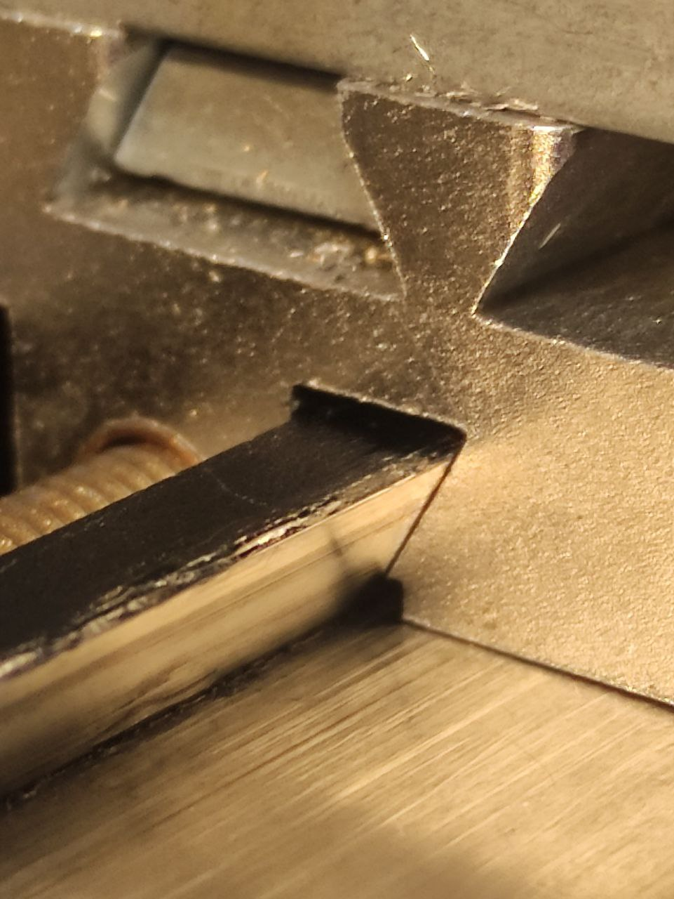
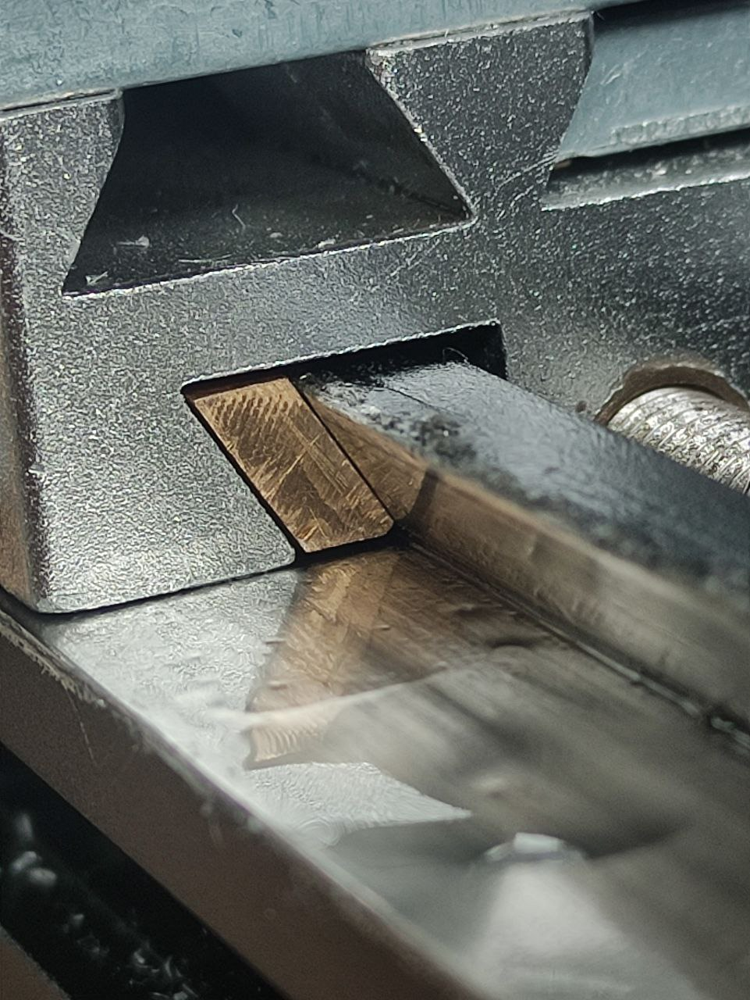
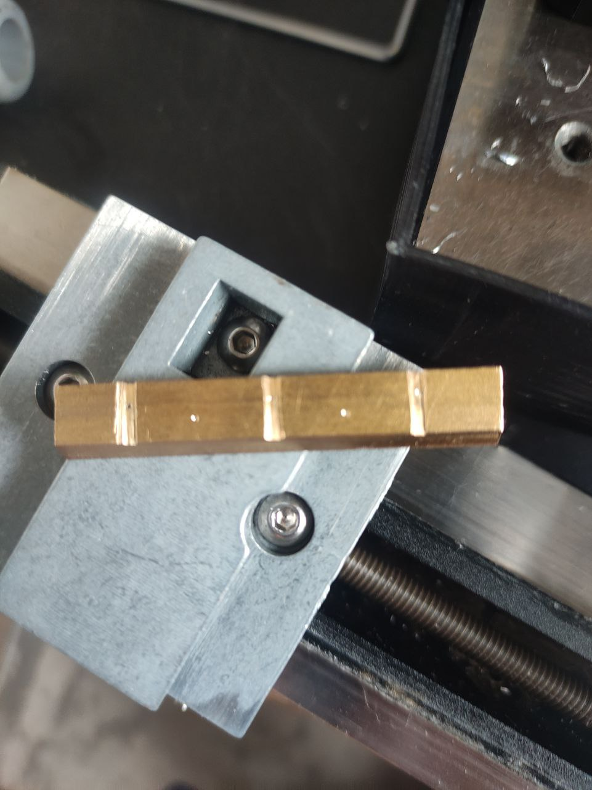

# Прижимные винты клина подачи

Существует несколько проблем в системе прижима клина в каретках:
* Перекос клина. Штатные винты с острыми носиками к сожалению не давят строго по центру, они сильно смещены к верху, поэтому клин не прижимается равномерно к поскости ласточкиного хвоста. Это буду решать размещением новых винтов с точкой прижатия к клину ниже чем существющие винты
* Малое количество точек прижима. Для продольной подачи всего 3 точки прижима клина, для поперечной - 4. При такой системе прижима винта клин выгибает волнами в местах где проиходит давление винта, особенно это заметно на пластковом штатном клине. Во первых происходит быстрый износ клина в этих местах, во вторых при движении каретки при выходе из зацепления с ласточкиным хвостом такого места "выгиба" происходит небольшой сдвиг каретки, что отражается на точности. Добавлю точек прижима
* Острый носик у стола каретки, которым она упирается в ответную часть ласточкиного хвоста, а остальные поверхности остаются не прижатыми до конца. Уберу эти острые части которые не участвуют в прижиме.

Показал доработку на продольной каретке, добавлю дополнительные винты прижима, причем располагая их ниже чем штатные, в шахматном порядке. Для продольной подачи требуется добавить 2 новых винта прижима, для поперечной 3 винта.

В каретке просверлил отверстия 2.5мм между штатными винтами прижима и нарезал резьбу м3. Расстояние от низа каретки выбирал минимально возможное 3мм. Если сделать расстояние до поверхности меньше - будет вспучивать алюминий при нарезке резьбы. Винты прижима получился составной, сначала идет винт который прижимает сам клин, сверху его короткий установочный винт который вкручивается в это же отверстие и фиксирует от раскручивания первый.

Так же убрал острые углы как на клине так и на каретке с прижимающихся к ластохвосту поверхностей. 

По итогу стал равномерный прижим как клина так и каретки к поверхностям направляющих. Ход каретки стал более плавным, а усилие прижима клина удалось увеличить

