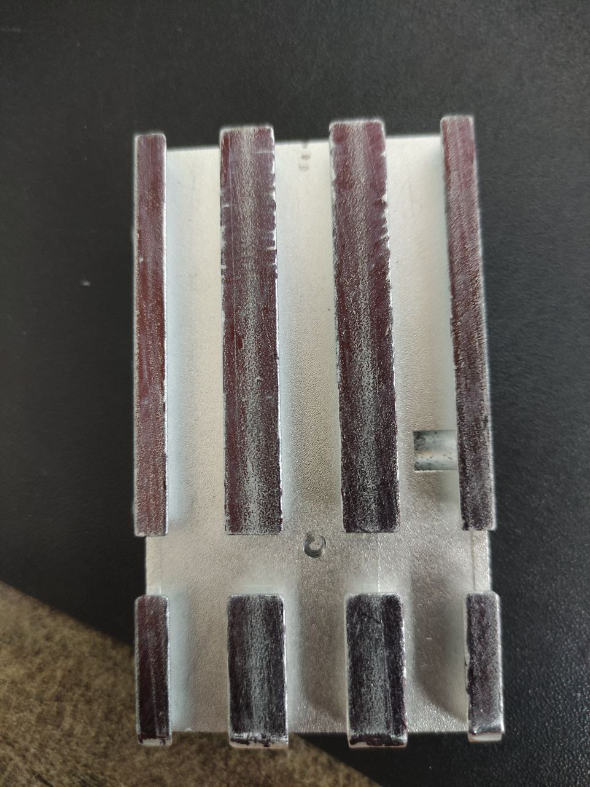
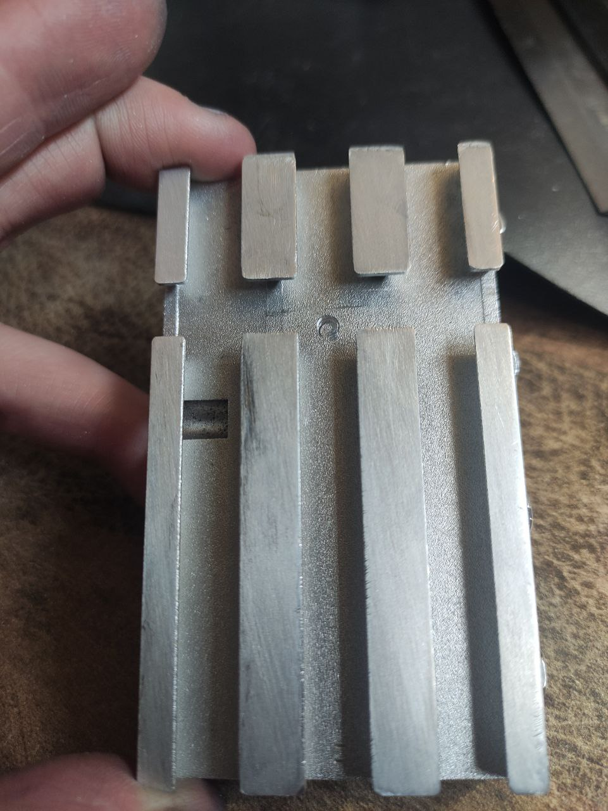
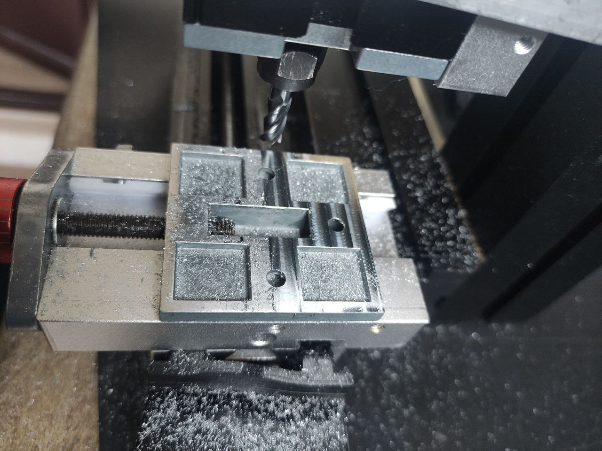
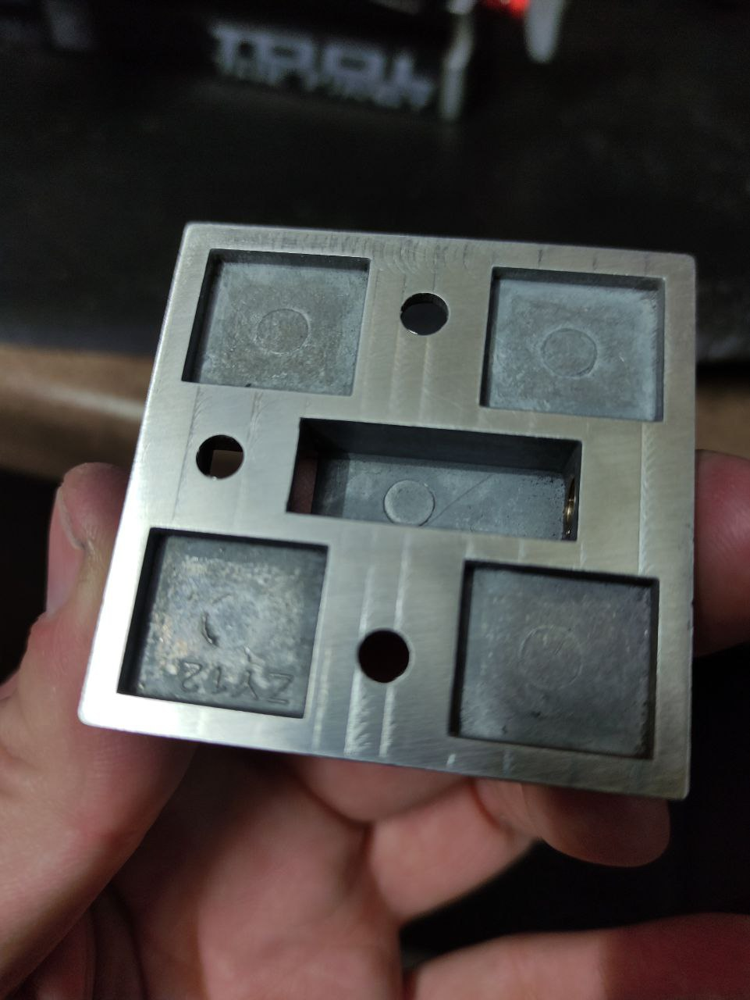
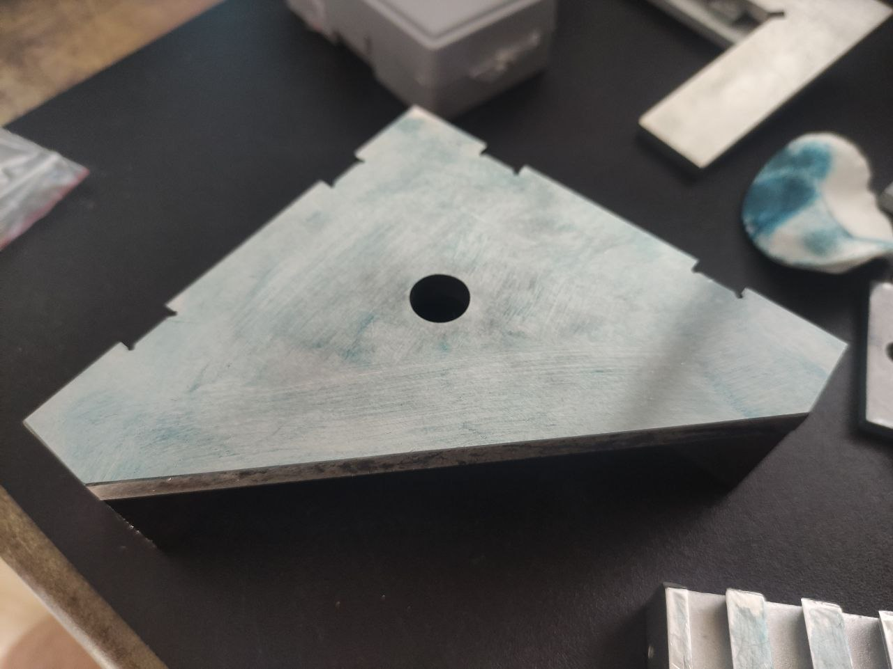
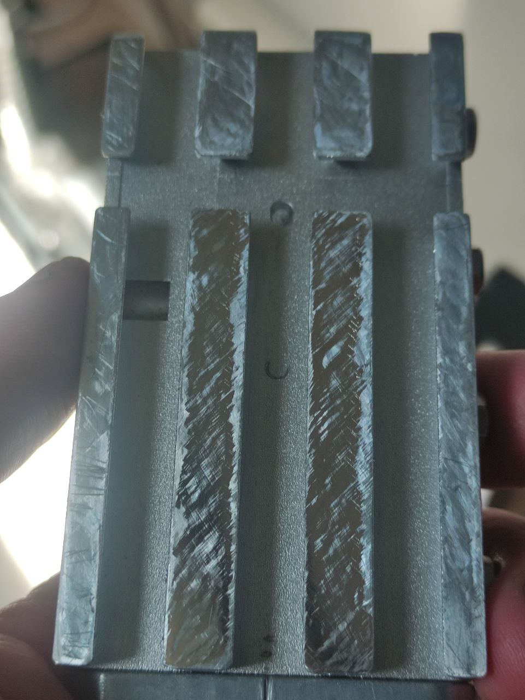
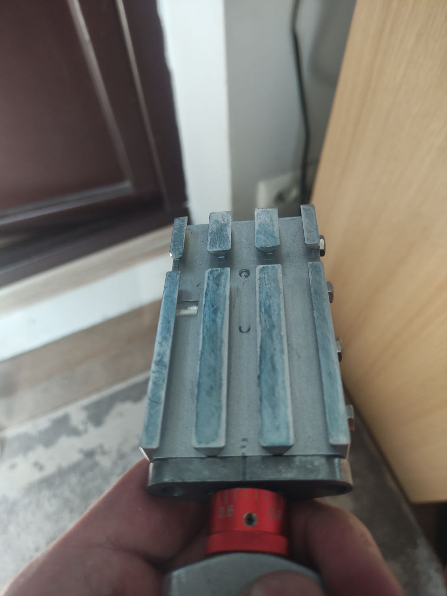

Занялся поперечной подачей. План такой: сначала вывести плоскость стола поперечки, далее перевернуть и закрепить на продольной этим столом, так что плоскость соединительного ластохвоста окажется вверху, далее отфрезеровать ее с минимальным съемом, пришлифовать на шкурке. Для начала нанес маркер на стол поперечки и немного потер шкуркой закрепленой на плоскости. Видно что у нас две  полоски имеют вершины (краска стерлась там где шкурка брала). Сначала надфилем сточил их, дальше шлифовал на шкурке. Процесс муторный и грязный. Далее перевернул каретку и закрепил вверх ногами, так что бы можно было отфрезеровать плоскость соединительной детали. Очень хорошо выставил голову. И тут совершил одну ошибку: использовал цанги вместо патрона. Дело в том что цанги комплектные совершенно не подходят к этому станку, в шпинделе просто нет ответного конуса, поэтому цанга не может центрироваться. Я всегда использую токарный патрон для фрезеровки. Ну и замер что получилось. Было 0.5мм, стало 0.2мм, результат недостаточный.
Решил не бросать дело выведения геометрии продольной и поперечной подач, первый раз решил пошабрить, за одно и немного научиться, тем более на алюминии это не очень сложно. И так из инструмента скм шабер, шаберная краска и уголок УСП 120х120, его боковая шлифованая сторона, проверил по лекальной линейке, ровная для наших целей сойдет. Сначала нанес тонким слоем краску на УСП, достаточно буквально одной точки, и ватным диском промакивая распределяю равномерно по поверхности УСП. Важно понимать что нам не красить, нам сделать отпечаток, слой должен быть минимальный, почти прозрачный. Далее берем каретку и возюкаем ее по УСП с краской, получаес отпечаток - там где есть краска - поверхности соприкасались, именно их мы и будем срезать шабером. На фото видно что сначала брало только 2 гребня стола, а в конце уже на каждом гребне есть краска. Так я пошабрил плоскость столов поперечной и продольной подач. Ну и тест с индикатором: было до шабрения 0.2мм отклонения, стало 0.08мм на весь ход подачи. На этом остановлюсь

